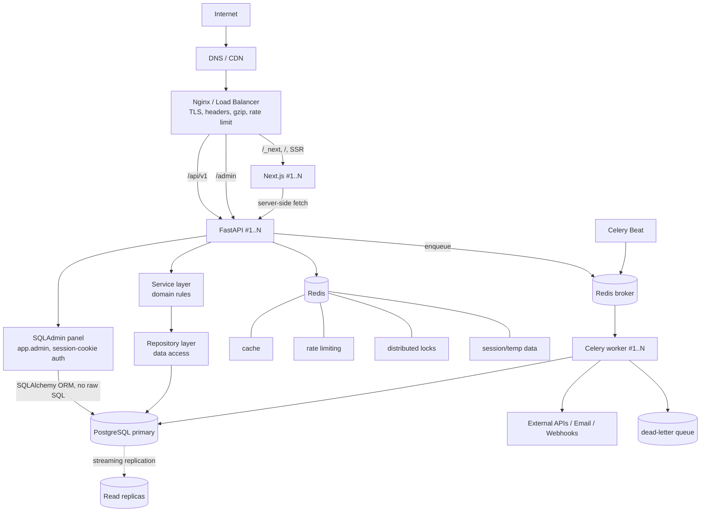
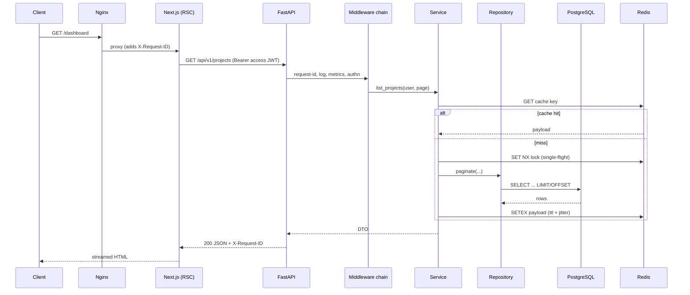
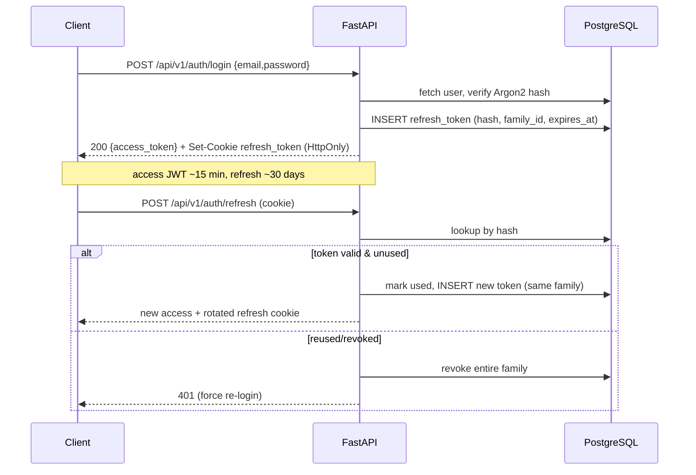

# Architecture

## 1. Architectural decisions (STEP 1)

| # | Decision | Rationale |
|---|----------|-----------|
| AD-1 | **Modular monolith**, not microservices | One deployable FastAPI app with hard module boundaries (`services/<domain>`, `repositories/<domain>`). Lower ops cost, transactional integrity, still extractable. |
| AD-2 | **Stateless app tiers** | No in-process sessions, caches-of-record, or sticky state. Sessions/refresh tokens in PostgreSQL, ephemeral data in Redis. Enables N replicas behind a plain round-robin LB. |
| AD-3 | **Async all the way** in the API | `asyncpg` + SQLAlchemy 2.0 async, async HTTP clients. CPU/blocking work is pushed to Celery. |
| AD-4 | **Layered backend**: Router -> Schema -> Service -> Repository -> Model -> DB | Routers do transport only; services own business rules; repositories own persistence. Dependency inversion via FastAPI `Depends`. |
| AD-5 | **JWT access + rotating refresh tokens** | Short-lived access JWT (stateless verification). Opaque refresh token hashed in DB with a `family_id`; rotation + reuse-detection revokes the family. Refresh cookie is `HttpOnly; Secure; SameSite=Strict`. |
| AD-6 | **Redis is infra, never source of truth** | cache-aside with jittered TTL + single-flight lock (stampede protection). Circuit-wrapped client: on failure, cache reads return `MISS` and the request proceeds against PostgreSQL. |
| AD-7 | **Celery for all >100ms or external-IO work** | Retries with exponential backoff + jitter, `acks_late`, per-task `soft_time_limit`, idempotency keys. Dead-letter queue for exhausted retries. |
| AD-8 | **Nginx at the edge** | TLS termination, HTTP->HTTPS, gzip/brotli, security headers, request-size limits, upstream keepalive, coarse rate limiting. App-aware rate limiting stays in FastAPI+Redis. |
| AD-9 | **Read-replica-ready data access** | `get_db()` (writer) and `get_db_ro()` (reader) dependencies. Until a replica exists both point at the primary — no code change when one is added. |
| AD-10 | **Config via Pydantic Settings** | Typed, validated at import; `Environment` enum drives conditional defaults; production asserts secrets are non-default. |
| AD-11 | **Frontend: Server Components by default** | Data fetching in RSC/route handlers through a typed API client; Client Components only for interactivity. Business logic lives in `features/<domain>`. |

## 2. High-level topology

## 3. Component responsibilities (STEP 3)

- **Nginx** — the only publicly exposed process. Terminates TLS, redirects 80->443, sets
  HSTS/CSP/`X-Content-Type-Options`/`Referer-Policy`, enforces `client_max_body_size`, gzips
  responses, load-balances the `frontend` and `backend` upstreams with keepalive, applies a coarse
  connection/request-rate limit as a DoS blunt instrument.
- **Next.js** — SSR/RSC UI. Talks to FastAPI via a single typed API client
  (`src/lib/api/*`). Holds no secrets beyond `NEXT_PUBLIC_*`. `middleware.ts` guards protected
  route groups by checking the auth cookie and redirecting.
- **FastAPI** — versioned REST (`/api/v1`). Middleware chain: request-ID -> structured access log
  -> Prometheus metrics -> security headers -> CORS -> rate limit -> global exception handler.
  Endpoints are thin; they validate (Pydantic) and delegate to services.
- **Service layer** (`app/services/<domain>/`) — business rules, transaction orchestration,
  cross-repository coordination, cache invalidation, task enqueueing. No FastAPI/HTTP imports.
- **Repository layer** (`app/repositories/<domain>/`) — all SQLAlchemy. Returns models/rows,
  never HTTP concerns. Pagination, filtering, sorting primitives live here.
- **PostgreSQL** — system of record. Connection pooling (`pool_size`, `max_overflow`,
  `pool_pre_ping`). Migrations via Alembic. Audit columns + soft delete on domain tables.
- **Redis** — cache-aside store, token-bucket rate limiter, `SET NX PX` distributed locks,
  Celery broker/result backend, short-lived data (email-verification codes, login throttle
  counters).
- **Celery** — workers consume from named queues (`default`, `emails`, `maintenance`). Beat
  schedules periodic jobs (token-family cleanup, metrics rollups). Failed-after-retries tasks are
  written to a DLQ list + `failed_jobs` table for inspection/replay.

## 4. Request lifecycle

## 5. Authentication flow

## 6. Scaling strategy

| Bottleneck | Response |
|------------|----------|
| API CPU / latency | add FastAPI replicas (`docker compose up --scale backend=N` / HPA). Stateless -> linear. |
| SSR load | add Next.js replicas. |
| Read QPS | provision PostgreSQL read replica(s); flip `get_db_ro()` DSN to the replica pool. |
| Write throughput | vertical scale primary; then partition hot tables; then extract a domain module into its own service + DB. |
| Job backlog | add Celery workers; split queues onto dedicated worker pools. |
| Cache capacity | Redis cluster / managed Redis with more shards. |

## 7. Failure scenarios

| Failure | Behavior |
|---------|----------|
| PostgreSQL down | `/readyz` fails -> LB drains instance; requests return 503 with sanitized body. |
| Redis down | cache = permanent MISS; rate limiter fails **open** with a logged warning; features needing locks/sessions return 503. |
| External API timeout | Celery task retries (backoff+jitter, cap); circuit breaker opens after threshold; user sees "pending". |
| Worker crash | `acks_late` -> task redelivered to another worker; idempotency key prevents double-effect. |
| Deploy rollout | rolling; `/readyz` gates traffic; DB migrations are backward-compatible (expand/contract). |
| Traffic spike | Nginx conn limit + FastAPI token bucket shed load with 429 before the DB saturates. |

See [deployment.md](deployment.md) for the Compose -> Kubernetes path and [observability.md](observability.md) for signals.
