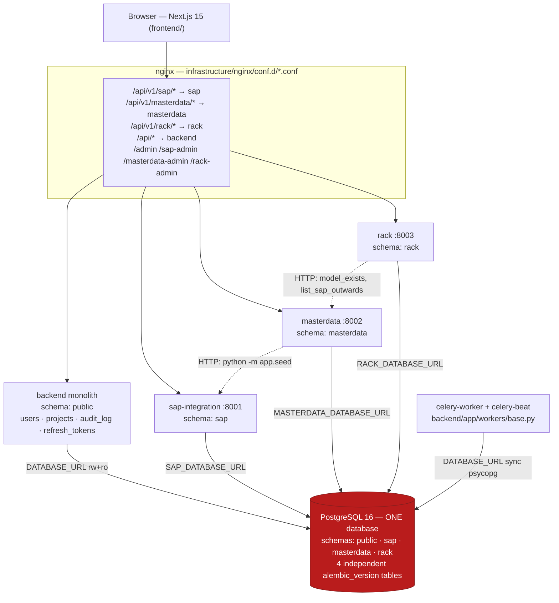
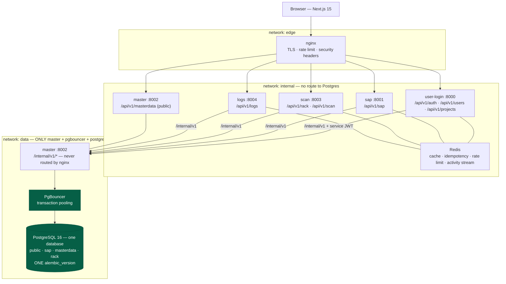
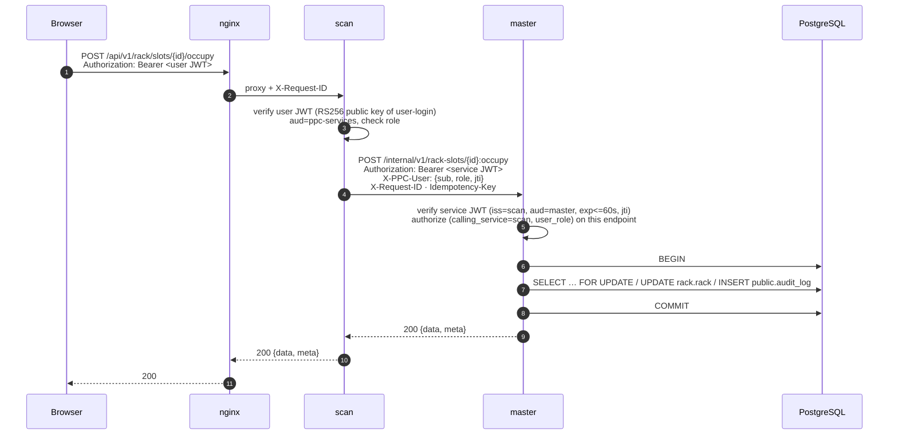
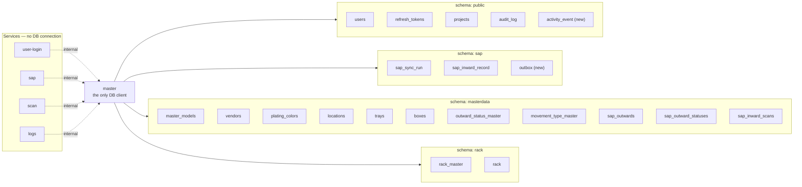
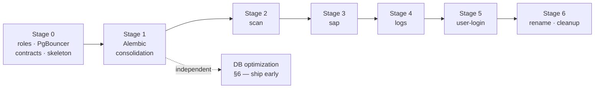

# Master Service Redesign — Architecture Review

**Status:** Review only. No code has been changed.
**Date:** 2026-09-13
**Repo state:** branch `main`, HEAD `50293e9` ("UI - WIP for Rack Locator")
**Audience:** the backend lead, tech lead and DevOps owner of PPC-WIM — the people who will approve
the migration, run the Alembic consolidation and own the PostgreSQL roles afterwards.

---

## 0. Method and honesty rules

Every factual claim below is cited as `path:line` against the working tree, or is a measurement taken
on the local PostgreSQL 16.14 instance (`localhost:5432/acme`) on 2026-09-13. Where something could
not be verified it is marked **unverified** rather than guessed.

Standards references are to `docs/00-engineering-guardrails.md` … `docs/10-infrastructure-and-load-balancing.md`.
Guardrails §6 requires a written ADR for every rule this design knowingly breaks; the ADRs this plan
needs are listed in §9.4. Note that **`docs/adr/` does not exist yet** — creating it is part of Stage 0.

`docs/requirements/` is an empty directory, so anything it would have contained is **unverified**.

### 0.0 A governing document contradicts this brief — read this first

`docs/BLUEPRINT.md` is **deleted in the working tree but present in git HEAD** (`git show
HEAD:docs/BLUEPRINT.md`, 1,762 lines). It is cited as authoritative by code comments in three services
(`services/rack/app/models.py:27`, `services/rack/app/masterdata_client.py:3`,
`services/masterdata/app/security.py:5`). Its §0 is titled **"Architecture Mandate —
Database-per-Service Microservices (MANDATORY, SUPERSEDING)"** and states, verbatim:

> * **Each service OWNS its own database.** A physically separate database … per service.
> * **There is NO shared application database.** Creating one database that holds tables for multiple
>   services is prohibited. Schema-per-module inside one Postgres instance does **not** satisfy this rule.
> * §6 / §8 / §29 … **Each service runs its own Alembic history against its own database.**

That is the opposite of what this review has been asked to design, on all three points: one database,
one Master client, one Alembic head.

Three facts matter for the decision:

1. **The code already diverged from BLUEPRINT §0 before this request.** All four services share one
   physical database today (§1.1), which BLUEPRINT §0.1 explicitly prohibits. BLUEPRINT §0.5 claims
   `sap-integration` "owns `sap_db`"; it does not — it owns the `sap` *schema* inside `POSTGRES_DB`
   (`services/sap-integration/app/models.py:39`, `docker-compose.yml:72`). The mandate was never
   implemented.
2. **BLUEPRINT §0.6 leaves the topology open.** `[OPEN-Q50]` asks: "one Postgres *instance* per
   service, or one instance hosting N isolated databases with per-service roles?" — unanswered. The
   brief for this review answers a third variant.
3. **Someone deleted the file from the working tree** and it is staged as a deletion. Whether that is
   a deliberate retirement of the mandate or an accident is **unverified** and only the project owner
   can say.

**This does not block the work.** The design below is delivered in full as specified. But the Master
Service model cannot be merged while a document in git HEAD calls it prohibited — so either
BLUEPRINT §0 is formally superseded by an ADR signed by the project owner (`ADR-0001`, §9.4), or the
file's deletion is confirmed as intentional and recorded. This is question 0 in §9.5, and it is the
only one that must be answered before Stage 0 starts.

### 0.05 Changes made after this review was written

This document describes the repo as of HEAD `50293e9`. Two changes have landed since, at the owner's
instruction. Where they contradict a section below, **they win** — the affected passages are listed so
nothing here is quietly wrong.

| Change | Effect on this document |
|---|---|
| **`/admin` on the monolith now registers all 19 tables** across `public`, `sap`, `masterdata` and `rack` (`backend/app/admin/views/services.py`), by reflecting the service schemas rather than importing their models. | §2.6 is largely closed — the three password-gated panels are redundant and their nginx routes can go. §3.9 carries the detail and the Stage-5 follow-up. |
| **`sap_outward_statuses` and `sap_inward_scans` folded into `sap_outwards`** — migration `0020_merge_outward_satellites`, see `docs/adr/0007-merge-sap-outward-satellites.md`. | §1.3 now has **21** tables, not 23. §1.5 loses the two `CASCADE` FKs into `sap_outwards`. §3.1's caveat about `sap_inward_scans` not being movable no longer applies — the table is gone. §3.4 rows 1–5 collapse to single-row updates. §4.2 loses two rows. §6.5's `sap_inward_scans` index advice is void; §6.8's retention row for it now applies to the `inward_scans` JSONB array inside the parent. |

Everything else — the measurements in §6, the security findings in §2.1–2.5 and §2.7–2.8, the shadow
databases in §2.20, the BLUEPRINT conflict in §0.0 — is unaffected.

### 0.1 Measurement environment

| Item | Value |
|---|---|
| PostgreSQL | 16.14, native Windows install, default `shared_buffers` |
| Live row counts | `rack.rack` 5,031 · `rack.rack_master` 20 · `masterdata.sap_outwards` 15 · `masterdata.master_models` 41 · `sap.sap_inward_record` 15 · `sap.sap_sync_run` 2 · `public.audit_log` 376 · `public.users` 2 · `masterdata.sap_inward_scans` 0 |
| Scale benchmark | a throwaway `ppc_bench` schema holding 84,000 tray slots (200 racks × 7 shelves × 4 rows × 15 trays, 35 % occupied), built with `CREATE TABLE … (LIKE rack.rack INCLUDING ALL)` so the index set matched production exactly. **Dropped after measurement** — no residue in the database. |

The live data is too small for meaningful plan comparison (5,031 rack slots fit in 83 pages), so every
before/after number in §6 is taken at the 84,000-slot scale — the size one real warehouse aisle grid
reaches once `rack_master` is loaded from the physical rack chart.

---

## 1. Current architecture

### 1.1 Diagram



**All five process families authenticate to PostgreSQL with the same `POSTGRES_USER` /
`POSTGRES_PASSWORD`** — the owner of every schema in the database (`docker-compose.yml:72,97,123`,
`docker-compose.prod.yml:80,98,113,132`, `.env.example:33,42,50,60`).

### 1.2 Every engine / `DATABASE_URL` creation point (verified by grep)

| # | Process | Engine created at | DSN variable | Notes |
|---|---|---|---|---|
| 1 | backend (web) | `backend/app/db/session.py:20-21` | `DATABASE_URL`, `DATABASE_RO_URL` | async, RW + RO engines, `pool_size=10`, `max_overflow=20` (`backend/app/core/config.py:57-61`) |
| 2 | backend (Celery) | `backend/app/workers/base.py:31` | `DATABASE_URL` rewritten `+asyncpg` → `+psycopg` | **sync** engine, `pool_size=5, max_overflow=5` — a fifth pool nobody counts |
| 3 | backend (Alembic) | `backend/alembic/env.py:17,34,45` | `DATABASE_URL` | version table in `public` |
| 4 | sap-integration | `services/sap-integration/app/db.py:15-16` | `SAP_DATABASE_URL` | `pool_size=5, max_overflow=10` (`config.py:48-50`) |
| 5 | sap-integration (Alembic) | `services/sap-integration/alembic/env.py:18,41,54` | `SAP_DATABASE_URL` | `version_table_schema=sap` (`env.py:30,43`) |
| 6 | masterdata | `services/masterdata/app/db.py:15-16` | `MASTERDATA_DATABASE_URL` | `pool_size=5, max_overflow=10` |
| 7 | masterdata (Alembic) | `services/masterdata/alembic/env.py:18,41,54` | `MASTERDATA_DATABASE_URL` | `version_table_schema=masterdata` |
| 8 | masterdata (seed script) | `services/masterdata/app/seed.py:24,79` | reuses `SessionLocal` | `python -m app.seed` |
| 9 | rack | `services/rack/app/db.py:15-16` | `RACK_DATABASE_URL` | `pool_size=5, max_overflow=10` |
| 10 | rack (Alembic) | `services/rack/alembic/env.py:18,41,54` | `RACK_DATABASE_URL` | `version_table_schema=rack` |
| 11 | rack (startup allocator) | `services/rack/app/main.py:45-49` | reuses `SessionLocal` | runs on **every replica** when `RACK_AUTO_ALLOCATE=true` |
| 12 | SQLAdmin panels ×4 | `backend/app/admin/config.py:26`; `services/rack/app/admin.py:35-41`, `services/masterdata/app/admin.py:261-266`, `services/sap-integration/app/admin.py:83-88` | reuse each service's engine | full CRUD from a browser |
| 13 | backend test fixture | `backend/tests/conftest.py:30-37` | `DATABASE_URL` | test-only |

Pool arithmetic at the production replica counts in `docker-compose.prod.yml`: backend 3 × (10+20) × 2
engines, sap 2 × 15, masterdata 2 × 15, celery-worker 2 × 10 → a theoretical ceiling of **~260
connections** against a default `max_connections = 100`. There is no PgBouncer anywhere in the repo.

> **The application uses one database, but the cluster holds four.** Every DSN above resolves to
> `POSTGRES_DB` (`acme`). The same cluster also contains populated databases literally named `sap_db`,
> `masterdata` and `rack`, carrying a second copy of the same rows at a different migration level.
> See §2.20 — this is a live hazard, not history.
(`rack` has no prod block at all — see §2.16.)

### 1.3 Table inventory — models vs live database

Verified against `pg_stat_user_tables`; all 23 tables exist.

| Schema | Table | Model | Indexes (live) | Rows (live) |
|---|---|---|---|---|
| `public` | `users` | `backend/app/models/user.py:11` | 4 | 2 |
| `public` | `projects` | `backend/app/models/project.py:10` | 3 | 0 |
| `public` | `refresh_tokens` | `backend/app/models/refresh_token.py:15` | 4 | 0 |
| `public` | `audit_log` | `backend/app/models/audit.py:11` | 3 | 376 |
| `sap` | `sap_sync_run` | `services/sap-integration/app/models.py:59` | 1 | 2 |
| `sap` | `sap_inward_record` | `services/sap-integration/app/models.py:81` | 7 | 15 |
| `masterdata` | `master_models` | `services/masterdata/app/models.py:86` | 3 | 41 |
| `masterdata` | `plating_colors` | `…:102` | 3 | 0 |
| `masterdata` | `vendors` | `…:116` | 3 | 0 |
| `masterdata` | `locations` | `…:132` | 4 | 0 |
| `masterdata` | `trays` | `…:163` | 4 | 0 |
| `masterdata` | `boxes` | `…:194` | 3 | 0 |
| `masterdata` | `outward_status_master` | `…:210` | 2 | 0 |
| `masterdata` | `movement_type_master` | `…:232` | 2 | 0 |
| `masterdata` | `sap_outwards` | `…:245` | **15** | 15 |
| `masterdata` | `sap_outward_statuses` | `…:354` | 4 | 0 |
| `masterdata` | `sap_inward_scans` | `…:381` | 4 | 0 |
| `rack` | `rack_master` | `services/rack/app/models.py:109` | 4 | 20 |
| `rack` | `rack` | `services/rack/app/models.py:153` | **10** | 5,031 |
| ×4 | `alembic_version` | — | 1 each | 1 row each |

**Documentation drift found.** `services/masterdata/README.md:36,39` documents a table called
`sap_inwards`; the model and the database both call it `sap_outwards`
(`services/masterdata/app/models.py:245`). The brief for this review also refers to `refresh_token`
singular; the real table is `refresh_tokens` (`backend/app/models/refresh_token.py:15`).

**Four independent Alembic heads, confirmed live:**

| Version table | Head |
|---|---|
| `public.alembic_version` | `0002_add_user_admin_role` |
| `sap.alembic_version` | `0003_real_model_numbers` |
| `masterdata.alembic_version` | `0019_movement_type_master` |
| `rack.alembic_version` | `0004_rack_qty_lot` |

### 1.4 Duplication between `sap.sap_inward_record` and `masterdata.sap_outwards`

Both tables carry `sap_reference_id` as their business key with a UNIQUE constraint
(`services/sap-integration/app/models.py:83`, `services/masterdata/app/models.py:247`) and both
currently hold 15 rows of the same SAP feed. The overlapping columns are
`transaction_date, dc_no, po_no, material_no, model_no, vendor_code, batch_no, lot_no, quantity,
movement_type, source_system`.

The copy is made by `services/masterdata/app/seed.py:117-141`, which pulls `GET /api/v1/sap/records`
over HTTP (`seed.py:40-62`) and upserts each row into `sap_outwards`. This is a **manual, operator-run
script** (`seed.py:162-163`) — there is no automatic propagation. A SAP sync that adds rows to
`sap.sap_inward_record` leaves `masterdata.sap_outwards` stale until somebody remembers to run it.

Each table also has columns the other lacks:

| Only in `sap.sap_inward_record` | Only in `masterdata.sap_outwards` |
|---|---|
| `material_description`, `vendor_name`, `remark`, `sync_id` (FK → `sap_sync_run`) | `sap_document_no`, `box_uid`, `tray_id`, `tray_type`, `no_of_trays`, `front_case_trays`, `back_case_trays`, `outward_status`, `received_pieces`, `received_qty`, `inward_status`, `inward_last_scan_at`, `model_id`, `vendor_id`, `plating_color_id`, `location_id`, `status` |

The split is really **SAP payload** versus **warehouse workflow state**, joined on `sap_reference_id`
with no database-level integrity between them. §4.3 turns that join into a real foreign key and §5 of
the migration plan makes one Master endpoint the single writer of both.

### 1.5 Foreign keys and implicit cross-schema references

Real foreign keys — all of them inside a single schema:

| FK | ON DELETE | Source |
|---|---|---|
| `public.projects.owner_id → users.id` | RESTRICT | `backend/app/models/project.py:21-23` |
| `public.refresh_tokens.user_id → users.id` | CASCADE | `backend/app/models/refresh_token.py:23` |
| `sap.sap_inward_record.sync_id → sap_sync_run.id` | SET NULL | `services/sap-integration/app/models.py:108-110` |
| `masterdata.locations.parent_location_id → locations.id` | RESTRICT | `services/masterdata/app/models.py:149-153` |
| `masterdata.sap_outwards.model_id → master_models.id` | SET NULL | `…:326-328` |
| `masterdata.sap_outwards.vendor_id → vendors.id` | SET NULL | `…:329-331` |
| `masterdata.sap_outwards.plating_color_id → plating_colors.id` | SET NULL | `…:332-334` |
| `masterdata.sap_outwards.location_id → locations.id` | SET NULL | `…:335-337` |
| `masterdata.sap_outward_statuses.sap_outward_id → sap_outwards.id` | CASCADE | `…:364-368` |
| `masterdata.sap_inward_scans.sap_outward_id → sap_outwards.id` | CASCADE | `…:392-396` |

`public.audit_log.actor_id` is a bare `BigInteger` with **no FK** to `users.id`
(`backend/app/models/audit.py:18`).

Implicit cross-schema references, held as plain strings with nothing enforcing them:

| Holder | Column | Logically references | Enforcement today |
|---|---|---|---|
| `rack.rack` | `occupied_by_model` (`services/rack/app/models.py:213`) | `masterdata.master_models.model_no` | optional HTTP check, **off by default** (`RACK_VALIDATE_MODEL = False`, `services/rack/app/config.py:59`); a network failure is treated as "allow" (`services/rack/app/api.py:460-470`, `masterdata_client.py:66-68`) |
| `rack.rack` | `sap_reference_id` (`…:223`) | `masterdata.sap_outwards.sap_reference_id` | none |
| `rack.rack` | `lot_no` (`…:222`) | `masterdata.sap_outwards.lot_no` | none |
| `masterdata.sap_outwards` | `sap_reference_id` (`…:287`) | `sap.sap_inward_record.sap_reference_id` | none |
| `masterdata.sap_outwards` | `box_uid` (`…:304`) | `masterdata.boxes.box_uid` | one application `SELECT` per write (`api.py:421-431`) |
| `masterdata.sap_outwards` | `tray_id`, `tray_type` (`…:305-306`) | `masterdata.trays` | application `SELECT`s per write (`api.py:433-461`) |
| `masterdata.sap_outwards` | `vendor_code` (`…:294`) | `masterdata.vendors.vendor_code` | one application `SELECT` per write (`api.py:406-419`) |
| `masterdata.sap_outwards` | `outward_status` (`…:310`) | `masterdata.outward_status_master.code` | CHECK constraint listing literals (`…:265-269`) that drifts from the master table |
| `masterdata.sap_outwards` | `movement_type` (`…:298`) | `masterdata.movement_type_master.code` | none |
| `public.audit_log` | `actor_id` | `public.users.id` | none |

### 1.6 Authentication and authorization, end to end

1. **User tokens.** `backend/app/core/security.py:42-54` mints HS256 JWTs carrying
   `sub`, `role`, `type=access`, `jti`, `iat`, `exp`. **No `iss`, no `aud`.** 15-minute lifetime
   (`backend/app/core/config.py:47`). Refresh tokens are opaque, SHA-256-hashed before storage and
   rotated with family reuse detection (`backend/app/models/refresh_token.py:12-13`,
   `backend/app/core/security.py:67-77`) — this part is well built.
2. **Monolith verification** re-reads the user from the database on every request and re-checks
   `is_active` (`backend/app/api/dependencies/auth.py:32-34`), then applies a role/permission matrix
   (`backend/app/core/rbac.py:25-41`, `dependencies/auth.py:43-59`). This satisfies docs/04 §2 rule 5.
3. **Microservice verification is identity-only.** The three modules are near-identical copies:
   `diff services/masterdata/app/security.py services/rack/app/security.py` differs only in the
   settings-flag name. Each decodes with the **shared `SECRET_KEY`**, checks `type == "access"` and
   returns `Principal(subject, role)`. **No microservice endpoint checks the role.** Every route takes
   `_u: User` and ignores it (`services/masterdata/app/api.py:198,208,227`;
   `services/rack/app/api.py:139,203,294`). Any authenticated user — including a `viewer` — can delete
   a master record or reset a receiving tally.
4. **Service tokens.** `services/rack/app/masterdata_client.py:29-41` mints its own JWT with
   `role: "service"` from the *same* `SECRET_KEY`. Because that secret is symmetric and shared, any
   service holding it can mint a token for **any** `sub` and **any** `role`, indistinguishable from
   one the monolith issued.
5. **`*_AUTH_OPTIONAL` switches** (`services/sap-integration/app/config.py:38`,
   `services/masterdata/app/config.py:36`, `services/rack/app/config.py:36`) disable the bearer
   requirement entirely and return `Principal(subject="anonymous")`. They default to `False`, but
   nothing stops them being `True` in staging or production: the microservice `Settings` classes have
   **no production validator at all**, unlike `backend/app/core/config.py:104-116`.
6. **SQLAdmin panels.** Four full-CRUD browser panels, all routed publicly through nginx
   (`infrastructure/nginx/conf.d/dev.conf:15,27,39,51`; `prod.conf:77,83,89,97`). The three
   microservice panels authenticate on a single password with a **hardcoded default in code**:
   `"sap-admin"` (`services/sap-integration/app/config.py:41`), `"masterdata-admin"`
   (`services/masterdata/app/config.py:39`), `"rack-admin"` (`services/rack/app/config.py:39`) — two
   of which are also committed to `.env.example:52,62`. When `ENVIRONMENT == "development"` the panels
   skip authentication completely (`services/rack/app/admin.py:34-37` and its two siblings). The
   monolith's panel is the good one: it authenticates against `users.admin_role`
   (`backend/app/admin/authentication.py:35,72`).
7. **Default `SECRET_KEY` hardcoded in code**, identical across all four services
   (`backend/app/core/config.py:45`; `services/*/app/config.py:33|33|35`).

### 1.7 Current deployment

| Aspect | Dev (`docker-compose.yml`) | Prod (`docker-compose.prod.yml`) |
|---|---|---|
| Migrations | `alembic upgrade head && uvicorn …` **inside the service command** (lines 73-75, 98-100, 124-126) | one-shot `*-migrate` services (`migrate:71`, `sap-migrate:96`, `masterdata-migrate:127`) |
| **`rack` service** | present (`:106-131`) | **absent** — no `rack`, no `rack-migrate`, and `nginx.depends_on` omits it (`prod.yml:24`) |
| Replicas | 1 each | frontend 2, backend 3, sap 2, masterdata 2, celery-worker 2, celery-beat 1 |
| Postgres host port | not published (`:157-171`) | not published (`:170-183`) — **correct, keep it** |
| Networks | `edge` + `internal`; only nginx joins `edge` | same |
| Rate limits | `limit_req zone=api_rl burst=40`, `limit_conn 20` | same with `limit_conn 30`; admin panels `burst=20` |
| Health | microservice `/healthz` **opens a DB connection** (`services/masterdata/app/main.py:57-63`, `services/rack/app/main.py:81-87`); no `/readyz` on any microservice | same |
| Security headers | none | full set including HSTS and CSP (`prod.conf:25-30`) |

### 1.8 What is reusable as-is

Genuinely good work the redesign should keep and generalise rather than rewrite:

| Asset | Location | Why keep |
|---|---|---|
| Typed settings with fail-fast production validation | `backend/app/core/config.py:104-116` | Exactly the docs/02 §6 pattern. Port it to the microservices, which lack it. |
| RW/RO engine split | `backend/app/db/session.py:20-24`, `config.py:100-102` | A read replica becomes a config change. Master must keep it. |
| Idempotency guard | `backend/app/api/dependencies/idempotency.py` | Redis-backed, 24 h TTL, fails open on Redis outage (guardrail 9). Reusable verbatim on internal endpoints. |
| Request-context middleware / trace IDs | `backend/app/middleware/request_context.py`, `backend/app/core/context.py` | The propagation spine docs/07 §5 requires. |
| Typed exception hierarchy + global handlers | `backend/app/core/exceptions.py:18-124` | Already the docs/07 §3 model; needs `trace_id` naming and DB-error mapping. |
| Generic `CrudRepository` | `services/masterdata/app/crud.py` | Sound shape. Must become **one** copy — see §2.9. |
| Contract tests | `services/*/tests/test_contract.py`, `backend/tests/` | The regression net this migration leans on. |
| Server-side derivation layer | `services/rack/app/topology.py:1-13` | The UI computes nothing. Correct per docs/07 §1. |
| Stable list ordering tie-break | `services/sap-integration/app/repository.py:55-62` | Someone already thought about pagination stability. Generalise it. |
---

## 2. Problems found

Each is verified against code and tied to the standard it breaks. Severity: **S1** blocks a
production release, **S2** must be fixed in this programme of work, **S3** should be fixed but is not
load-bearing.

### 2.1 — S1 — Four processes share one superuser-grade credential

`docker-compose.yml:72,97,123` and `docker-compose.prod.yml:80,98,113,132` hand every service the same
`${POSTGRES_USER}:${POSTGRES_PASSWORD}`, which is the database owner created by the Postgres image and
the owner of all four schemas (`infrastructure/postgres/init/02-service-schemas.sql:5-16` runs as that
user). Nothing at the database level stops the `rack` service reading `public.users.hashed_password`
or dropping the `masterdata` schema. The isolation described in `.env.example:26-31` is a naming
convention, not a control.

Breaks **docs/03 §2.1** (every endpoint declares a permission — the database layer declares none),
**docs/04 §2 rule 6** (enforce the check where it cannot be bypassed) and the least-privilege
principle behind **docs/03 §6**.

### 2.2 — S1 — Four independent Alembic heads on one database

Confirmed live: `public` → `0002_add_user_admin_role`, `sap` → `0003_real_model_numbers`,
`masterdata` → `0019_movement_type_master`, `rack` → `0004_rack_qty_lot`, each in its own
`alembic_version` table via `version_table_schema` (`services/*/alembic/env.py:30,43`).

Consequences:
* No single `alembic upgrade head` describes the database. There is no one command a release runs and
  no one revision a rollback targets.
* No migration can span schemas, so the cross-schema FKs in §4.3 are **impossible to express today**.
* Each `env.py` also pins `search_path` at the connection level and issues its own
  `CREATE SCHEMA IF NOT EXISTS` with a manual commit (`services/masterdata/alembic/env.py:58-73`) —
  90 lines of identical, subtle plumbing replicated three times.

Breaks **docs/06 §5 rules 1-3** and **docs/10 §6.4** (a tested rollback procedure is not possible
across four unsynchronised heads).

### 2.3 — S1 — Shared static HS256 secret used as both user and service credential

One symmetric `SECRET_KEY` verifies user tokens in four services
(`backend/app/core/security.py:59`, `services/*/app/security.py:36-38`) **and** signs the service
token `rack` mints for itself (`services/rack/app/masterdata_client.py:30-40`). Because HS256 is
symmetric, verification capability equals minting capability: compromise of any one of the four
processes — including the one exposed at `/rack-admin` — yields the ability to forge a token for any
user with any role. Tokens carry no `iss` and no `aud` (`backend/app/core/security.py:44-51`), so a
token minted for one audience is accepted by all of them.

Breaks **docs/03 §1.5 / §1.10** and **docs/04 §2 rule 4** (permission for the action, not just the
resource — a service token is indistinguishable from a user token).

### 2.4 — S1 — No authorization at all in the three microservices

`Principal` carries a `role` (`services/masterdata/app/security.py:23-25`) and **not one endpoint
reads it**. Representative: `DELETE /api/v1/masterdata/models/{id}`
(`services/masterdata/app/api.py:224-228`), `POST /api/v1/rack/masters/materialize`
(`services/rack/app/api.py:206-213`), `POST /api/v1/masterdata/sap-inward/{id}/reset` which deletes
every scan row for a line (`services/masterdata/app/api.py:845-863`). All are reachable by any
authenticated user.

Breaks **guardrail rule 3** ("every API endpoint declares authentication *and authorization*"),
**docs/03 §2.3**, **docs/04 §2 rules 4 and 6** and **docs/02 §9** ("an endpoint tested only with an
admin user is an untested endpoint" — here there is no role test to write against).

### 2.5 — S1 — `AUTH_OPTIONAL` switches with no production guard

`SAP_AUTH_OPTIONAL` / `MASTERDATA_AUTH_OPTIONAL` / `RACK_AUTH_OPTIONAL`
(`services/*/app/config.py:38|36|36`) disable bearer verification wholesale and return
`Principal(subject="anonymous")` (`services/*/app/security.py:31-34`). The microservice `Settings`
classes have **no `_validate_production` validator**, so setting one to `true` in a production `.env`
silently opens the whole service. Compare `backend/app/core/config.py:104-116`, which refuses to boot
with a placeholder secret.

Breaks **guardrail rule 3** and **docs/03 §6.1**.

### 2.6 — S1 — Admin panels publicly routed with hardcoded default passwords

Four SQLAdmin panels are proxied on the public listener (`prod.conf:77,83,89,97`). Three of them gate
on a single password whose default is a **string literal in the source**:
`services/sap-integration/app/config.py:41`, `services/masterdata/app/config.py:39`,
`services/rack/app/config.py:39`; two are also committed in `.env.example:52,62`. In
`ENVIRONMENT == "development"` authentication is skipped entirely
(`services/rack/app/admin.py:34-37`, and the same three lines in the other two). The panels perform
unrestricted CRUD on every table they expose — `SapOutwardAdmin`, `RackAdmin`, `SapInwardRecordAdmin`.

Breaks **guardrail rule 6**, **docs/03 §6.2** ("default and seeded credentials removed") and
**docs/03 §6.3** ("admin panels restricted by IP or behind SSO"). The nginx config even documents the
missing control as a comment rather than applying it (`prod.conf:95-96`).

### 2.7 — S1 — External HTTP calls inside open database transactions

Three instances, all on write paths:

| Call site | What happens |
|---|---|
| `services/rack/app/allocation.py:174` then `:176` | `reset_allocations()` writes and flushes, **then** `list_sap_outwards()` makes up to 25 HTTP requests to masterdata (`masterdata_client.py:83-96`) with the transaction open |
| `services/rack/app/api.py:418` (also `:377`, `:392`) | `occupy_slot` loads the slot, then calls `_assert_model_known` → `model_exists` (HTTP, 5 s timeout) before flushing |
| `services/sap-integration/app/service.py:92` then `:101` | `add_sync_run()` inserts and flushes, **then** `provider.fetch_inward_records()` calls the SAP provider with the transaction open |

Breaks **docs/02 §5.2** verbatim: "External calls such as HTTP requests, email, and payment gateways
are never made inside an open transaction."

### 2.8 — S1 — Failed SAP sync runs are rolled back and lost

`services/sap-integration/app/service.py:107-115` records `status="FAILED"` and the error text on the
run row, flushes, and then raises `HTTPException(502)`. That exception propagates through
`get_session` (`services/sap-integration/app/db.py:30-35`), which rolls the transaction back — so the
`FAILED` row is **never committed**. `GET /api/v1/sap/sync-runs` will therefore never show a failure,
and `sap.sap_sync_run` holds 2 rows against an unknown number of real attempts.

Breaks **docs/07 §5.3** (a swallowed failure), **docs/02 §8.3-8.4** (failed jobs must be visible) and
**docs/03 §8.4**.

### 2.9 — S2 — Byte-identical duplicated modules across services

`diff services/masterdata/app/crud.py services/rack/app/crud.py` differs on **one line** — the
docstring. `security.py` differs on two lines (the settings-flag name). `errors.py` differs on one
(the logger name). `db.py` differs on the settings prefix. That is roughly 350 lines of logic
maintained in three places, which is exactly how the `Page` envelope and the `ilike`-over-N-columns
search drifted into three services without anyone noticing they all violate docs/02 §3.2.

Breaks **docs/05 §5.3** ("duplicated logic appearing a third time is extracted").

### 2.10 — S2 — The response envelope and error contract are not implemented anywhere

docs/02 §3.2 mandates `{"data": …, "meta": {…}}` for success and
`{"error": {code, message, details, trace_id}}` for failure.

* Success: every list endpoint returns a bare `{items, total, page, page_size}`
  (`services/masterdata/app/schemas.py:37-41`, `services/masterdata/app/api.py:188-193`,
  `services/rack/app/api.py:154-159`, `services/sap-integration/app/service.py:61-66`). Single-object
  endpoints return the object unwrapped.
* Errors: the microservices emit `{"error": {code, message, status}}`
  (`services/masterdata/app/errors.py:30-31`) — **no `trace_id` at all**. The monolith emits
  `request_id` instead of `trace_id` (`backend/app/core/exceptions.py:75-86`).

Breaks **docs/02 §3.2** and **docs/07 §3** (rule 3: the frontend must be able to correlate a failure
to a log line). Fixing this changes the frontend contract, so §7 schedules it explicitly rather than
letting it happen by accident.

### 2.11 — S2 — Data migrations embedded in schema migrations

Of the 19 masterdata revisions, **14 contain data operations** and 7 of those mix data with DDL in the
same revision:

| Revision | DDL ops | Data ops |
|---|---|---|
| `0002_seed_rack_k_models` | 0 | 2 |
| `0003_seed_vendors` | 0 | 2 |
| `0005_boxes_and_sap_outwards` | 12 | **10** |
| `0006_trim_outwards_and_vendors` | 0 | 2 |
| `0008_case_trays` | 4 | 3 |
| `0009_clean_non_master_vendors` | 0 | 1 |
| `0010_fill_tray_type_and_vendors` | 0 | 4 |
| `0011_seed_boxes` | 0 | 1 |
| `0012_movement_type_101` | 0 | 1 |
| `0013_sap_outward_statuses` | 3 | 5 |
| `0014_default_outward_status_new` | 0 | 3 |
| `0015_outward_status_master` | 1 | 1 |
| `0016_real_model_numbers` | 0 | 3 |
| `0017_dedupe_box_uid` | 0 | 2 |
| `0019_movement_type_master` | 1 | 1 |

`0009_clean_non_master_vendors` and `0017_dedupe_box_uid` **delete rows** during a deployment step.

Breaks **docs/06 §5 rule 4** ("data migrations that run for more than a few seconds run as a managed
job, not inside the deployment step") and **docs/10 §6.4** (rolling back code does not undo a
destructive data migration).

### 2.12 — S2 — Over-indexing on the two highest-write tables

Live index counts: `masterdata.sap_outwards` **15**, `rack.rack` **10**. On `sap_outwards` that is 13
declared indexes (`services/masterdata/app/models.py:250-281`) plus the PK and the unique constraint;
on `rack` it is 8 declared (`services/rack/app/models.py:184-191`) plus PK and unique. Every one of
the declared indexes is a **single-column** index that matches no query shape in the routers —
`list_sap_outwards` filters on combinations (`api.py:567-596`) and `locate` filters on
`(status, slot_state)` plus location (`topology.py:469-478`).

`pg_stat_user_indexes` on the live database shows `idx_scan = 0` for every index on `sap_outwards`
and for 8 of the 10 on `rack.rack`.

Measured cost (84,000-row benchmark, §6.4): the current index set makes a bulk `materialize()` insert
of 252,000 slots take **10.01 s / 8.70 s** versus **6.43 s / 5.75 s** with a query-shaped set — about
**34 % slower writes** — and costs **20 MB of index against a 21 MB heap** versus 14 MB.

Breaks **docs/06 §2.2, §2.3, §2.6** and the explicit warning under docs/06 §2: "A table with fifteen
indexes on a high write path is a design problem."

### 2.13 — S2 — Chatty and shape-wrong cross-service client calls

* `model_exists` (`services/rack/app/masterdata_client.py:48-68`) answers *"does this exact model_no
  exist?"* by calling `GET /models?search=<model_no>&page_size=50` and then filtering the 50 results
  in Python (`:65`). Server-side that runs a `COUNT(*)` over the full filtered set
  (`services/masterdata/app/crud.py:65`) plus an `ILIKE '%…%'` across three columns
  (`api.py:38`, `crud.py:60-63`) — to answer a question a unique index could answer in one index
  lookup.
* `list_sap_outwards` (`masterdata_client.py:71-96`) walks up to **25 sequential HTTP pages of 200
  rows** inside one request, each triggering its own `COUNT(*)`, to materialise the whole outward feed
  in memory for the allocator.
* `services/masterdata/app/seed.py:108-111` and `:149` load **every** `SapOutward` row into a dict,
  twice.

Breaks **docs/05 §5.6** ("loops that call the database or an API inside the body are treated as
defects"), **docs/05 §3.3** and **docs/06 §3** ("loading a whole table to filter in Python").

### 2.14 — S2 — Unbounded queries and Python-side ranking on read paths

| Endpoint | Code | Problem |
|---|---|---|
| `GET /api/v1/rack/locate` | `services/rack/app/topology.py:469-491` | Fetches **every** empty slot as a hydrated ORM object, scores each in Python, sorts in Python, returns `limit ≤ 50`. Measured at 84,000 slots: **1,096–1,610 ms**, of which 864–1,196 ms is ORM hydration. |
| `GET /api/v1/rack/find` | `services/rack/app/topology.py:608-626` | No pagination at all; `ILIKE '%q%'` plus a full `ORDER BY`, then sums `qty` in Python (`:627`). |
| `GET /api/v1/rack/resolve` | `topology.py:566-582` | `ILIKE '%term%'` across four columns with no trigram index. |
| `POST /api/v1/rack/allocate` | `allocation.py:117-124` | Loads every empty slot into memory as ORM objects. |
| Every list endpoint | `crud.py:65`, `sap-integration/app/repository.py:52`, `masterdata/app/api.py:714-716` | Unconditional `COUNT(*)` over the filtered set on every page request. Measured: **46.8 ms / 2,665 buffers** at 84,000 rows. |
| Every list endpoint | `crud.py:71`, `repository.py:63`, `api.py:719-720` | `OFFSET` pagination. Measured at page 500: **68.1 ms / 2,710 buffers** versus **0.28 ms / 30 buffers** for keyset. |

`locate` at 1.1–1.6 s exceeds the **500 ms hard limit** in docs/05 §2 for a simple read — by docs/05
that is a defect, not a future improvement. Also breaks **guardrail rule 4**, **docs/02 §4.3** and
**docs/06 §3**.

### 2.15 — S2 — Random UUIDv4 primary keys on the high-insert tables

`services/rack/app/models.py:78` and `services/masterdata/app/models.py:62` both use
`default=uuid.uuid4` for every primary key. `rack.rack` is populated in bulk by `materialize()`
(`topology.py:126-149`) — one row per shelf × row × tray — and `sap_inward_scans` grows one row per
physical scan. Random UUIDs scatter B-tree inserts across the whole index, which is what the 20 MB of
index on a 21 MB heap in §2.12 partly reflects.

Relevant to **docs/06 §2** (index maintenance cost) and **docs/04 §4** (which endorses UUIDs for
external identifiers — the recommendation in §6.6 keeps the column type and only changes how new
values are generated).

### 2.16 — S2 — The `rack` service does not exist in the production compose file

`docker-compose.prod.yml` defines `nginx, frontend, backend, migrate, sap-integration, sap-migrate,
masterdata, masterdata-migrate, celery-worker, celery-beat, postgres, redis`. There is **no `rack`
service and no `rack-migrate`**, and `nginx.depends_on` (`prod.yml:24`) omits it — yet `prod.conf:58`
proxies `/api/v1/rack/` to a `rack_upstream`. In production nginx would fail to resolve that upstream
or return 502 for the entire Rack Locator UI.

Breaks **docs/10 §5 rule 1** ("staging matches production in configuration, versions, and topology").

### 2.17 — S2 — Migrations run on container start in dev; a data job runs on every replica

`docker-compose.yml:73-75, 98-100, 124-126` run `alembic upgrade head` in the service command. With
`deploy.replicas > 1` that is N concurrent migration attempts against one database. Separately,
`RACK_AUTO_ALLOCATE` runs the full allocator in the FastAPI lifespan
(`services/rack/app/main.py:30-31, 37-56`) — a write-heavy, HTTP-fanning job that would run once per
replica, with no distributed lock.

Breaks **docs/10 §3 requirement 6** ("database migrations run as a separate deployment step, not on
instance startup") and **docs/10 §3 requirement 4** ("scheduled jobs run from a single scheduler or
use a distributed lock").

### 2.18 — S3 — `/healthz` performs a database round trip

`services/masterdata/app/main.py:57-63` and `services/rack/app/main.py:81-87` open a connection and
run `SELECT 1` on every liveness probe (every 10–15 s per replica). There is **no `/readyz`** on any
microservice. The monolith does this correctly (`backend/app/api/v1/routes/health.py:13-36`).

Breaks **docs/10 §4.1** ("a health check that queries the database on every probe adds avoidable load
— keep liveness cheap").

### 2.19 — S3 — Missing audit columns and no soft-delete partial indexes

docs/06 §1.8 requires `created_at`, `updated_at`, `created_by`, `updated_by` on every business table.
`created_by` / `updated_by` exist on **none** of the 19 business tables — verified across
`services/*/app/models.py` and `backend/app/models/`. The one place an actor is captured is
`sap_inward_scans.scanned_by` (`services/masterdata/app/models.py:402`), a free-text `String(64)` set
from `Principal.subject` (`api.py:798`).

Soft delete is `status='active'|'inactive'` across masterdata and rack (`models.py:80-82`,
`:96-98`), and `deleted_at` in the monolith (`backend/app/db/base.py:33-40`). docs/06 §1.9 requires a
partial index excluding deleted rows on the common queries; the monolith has one
(`backend/app/models/project.py:13-17`) and the microservices have **none** — every filtered query
carries `status='active'` with no index supporting it.

### 2.20 — S1 — Three shadow databases hold a second, stale copy of the live data

The PostgreSQL cluster contains **four** PPC databases, not one:

| Database | Contents | Alembic head | Size |
|---|---|---|---|
| **`acme`** — the one every service connects to (`.env`, `docker-compose.yml:72,97,123`) | `public` + `sap` + `masterdata` + `rack` schemas | 4 heads (§1.3) | 13 MB |
| `sap_db` | `public.sap_inward_record` **15 rows**, `sap_sync_run` **2 rows** | `0003_real_model_numbers` | 8.3 MB |
| `masterdata` | `public.sap_outwards` **15 rows**, `master_models` **41 rows**, 11 tables | **`0018_sap_inward_receiving`** | 9.2 MB |
| `rack` | `public.rack` **5,031 rows**, `rack_master` **20 rows** | `0004_rack_qty_lot` | 10.2 MB |

These are not empty scaffolding — they are **full, populated copies at the same row counts as `acme`**,
left over from an earlier database-per-service attempt (the topology `docs/BLUEPRINT.md` §0.3 mandates,
see §0.0). `pg_stat_user_tables` reports `n_live_tup = 0` for all of them because they have never been
analysed, which is why they look empty at a glance.

Two things make this S1 rather than untidy:

1. **The `masterdata` database is one migration behind `acme`** — head `0018_sap_inward_receiving`
   versus `0019_movement_type_master`. Its `sap_outwards` table therefore has a different shape from
   the live one.
2. **The names are a trap.** A developer who reads `MASTERDATA_DATABASE_URL` and points it at a
   database called `masterdata` — the obvious thing to do — gets a schema-divergent copy of real
   business data and no error. Same for `rack` and `sap_db`. The only thing preventing this today is
   that `.env` happens to say `/acme` in all four DSNs.

**Action (Stage 0):** confirm with the owner that these are dead, `pg_dump` all three for the archive,
then `DROP DATABASE sap_db; DROP DATABASE masterdata; DROP DATABASE rack;`. Leaving a populated,
identically-named, schema-divergent copy of production data on the same cluster is a data-integrity
incident waiting for someone to mistype a DSN. Breaks **docs/03 §8.6** (production data copied into
lower environments only after masking, with approval) and **docs/10 §5 rule 3**.

**Do not drop them without the owner's confirmation** — if any of them is someone's in-progress
database-per-service extraction, it is the only copy of that work.

### 2.21 — S3 — Miscellaneous, verified

* **Non-atomic status update across two tables.** `_sync_outward_status`
  (`services/masterdata/app/api.py:506-533`) writes both `sap_outwards.outward_status` and
  `sap_outward_statuses.status` but only calls `session.flush()`. It happens to be atomic today
  because both writes share one request transaction — which is exactly the property a naive split into
  two Master calls would destroy. Listed here so the target design preserves it (§3.4).
* **`ENVIRONMENT` typed as a bare `str` in the microservices** (`services/*/app/config.py:22`) versus
  a validated enum in the monolith (`backend/app/core/config.py:35`), so a typo like `producton`
  silently selects development behaviour — including open admin panels (§2.6).
* **`except Exception` swallowing on cross-service calls** (`masterdata_client.py:66-68`,
  `services/rack/app/main.py:55-56`, `services/rack/app/allocation.py:51-52`). Each is logged, which
  docs/07 §5.3 permits, but the `model_exists` case converts a validation failure into a silent
  "allow", which is a correctness decision hidden in an error handler.
* **`README` drift** (`services/masterdata/README.md:36,39` — `sap_inwards` vs `sap_outwards`),
  breaking **guardrail §4.6**.
* **No `docs/adr/` directory**, so none of the exceptions this codebase already relies on are
  documented — **guardrail §6**.
---

## 3. Target design

### 3.1 Verifying the five-service mapping against the code

The mapping in the brief holds, with three findings that change how it is executed.

| Target service | Built from | Verdict |
|---|---|---|
| `master` | `services/masterdata` | **Fits.** It already owns the masters, already serves `rack` over HTTP (`masterdata_client.py`), already holds the workflow tables, and already has the generic `CrudRepository` that becomes Master's data-access layer. |
| `sap` | `services/sap-integration` | **Fits.** Provider abstraction is already isolated (`app/providers/`), and `SapRepository` (`repository.py`) is the only DB coupling — a clean seam. |
| `scan` | `services/rack` **+** the inward-scan logic in masterdata | **Fits, with a cost.** `sap_inward_scans` has a `CASCADE` FK to `masterdata.sap_outwards` (`models.py:392-396`) and the scan handler updates four columns on the parent in the same transaction (`api.py:791-803`). The *table* therefore cannot move; only the *logic* moves. Under the target that is fine — `scan` calls one Master endpoint that does both writes atomically. |
| `user-login` | `backend/` monolith | **Fits.** `projects` is still live: `backend/app/api/v1/router.py:13` mounts it and `frontend/src/features/projects/` consumes it (5 files, including the dashboard). It stays. |
| `logs` | new | **Fits, but not as a write path.** See §3.5 — audit rows that must be atomic with a business write cannot be routed through a second service without losing atomicity. |

**Nothing in the code needs a sixth service.** Two pieces of existing functionality need an explicit
home, and both land inside `master`: the four SQLAdmin panels (which today each bind to their own
engine) and the `masterdata` seed script.

**Rename decision — evidence-based:** keep the directory at `services/masterdata/` through Stages 0-5
and rename it to `services/master/` as a single mechanical commit in Stage 6. Reasons:

* The directory name is load-bearing in six places — `docker-compose.yml:88`,
  `docker-compose.prod.yml:110,128` (build contexts), `infrastructure/nginx/nginx.conf` (upstream
  name, **unverified**: the upstream block was not read for this review), the Dockerfile `WORKDIR`,
  `alembic.ini:2` and the `masterdata-migrate` service name. Renaming it while a strangler migration
  is in flight means every rollback step has to be written twice.
* The public path `/api/v1/masterdata/*` and the `MASTERDATA_*` env prefix **do not change at all**,
  in Stage 6 or ever, so the rename buys clarity and nothing else.
* Doing it last makes it a diff a reviewer can verify by eye.

### 3.2 Target diagram



`master` is one process that serves two routers: the **public** `/api/v1/masterdata/*` router that
exists today, unchanged, and a new **internal** `/internal/v1/*` router bound to the data network and
never proxied by nginx.

### 3.3 Master responsibilities

| Master owns | Master does not own |
|---|---|
| The only `DATABASE_URL` in the system | Business workflow decisions (which slot to pick, when to call SAP) |
| The engine, pool and the RW/RO split | HTTP-facing rate limiting (nginx) |
| **All** Alembic migrations — one linear head | Session/JWT issuance (that is `user-login`) |
| Every table in all four schemas | SAP provider protocol (that is `sap`) |
| Transaction boundaries — one Master request = one transaction | Retention *policy* (that is `logs`; Master executes it) |
| Mapping DB errors to stable codes | |
| Per-endpoint authorization on `(calling service, end user role)` | |

### 3.4 Transaction inventory — every current multi-table write, mapped

docs/02 §5.1 requires every multi-table write to be one explicit transaction. This table is the
contract: each row becomes **one** Master endpoint, never two calls.

| # | Today | Tables written | Becomes |
|---|---|---|---|
| 1 | `create_sap_outward` (`masterdata/app/api.py:605-616`) | `sap_outwards` + `sap_outward_statuses` | `POST /internal/v1/sap-outwards` |
| 2 | `update_sap_outward` (`…:624-637`) | same two | `PATCH /internal/v1/sap-outwards/{id}` |
| 3 | `patch_sap_outward_by_ref` (`…:645-666`) | same two | `PATCH /internal/v1/sap-outwards/by-ref/{sap_reference_id}` |
| 4 | `sap_inward_scan` (`…:758-824`) | `sap_inward_scans` insert + 4 columns on `sap_outwards` | `POST /internal/v1/sap-inward-scans` — **one call**, idempotency key required |
| 5 | `sap_inward_reset` (`…:850-863`) | bulk delete `sap_inward_scans` + reset 4 columns on `sap_outwards` | `POST /internal/v1/sap-inward/{id}:reset` |
| 6 | `create_master` + `materialize` (`rack/app/api.py:168-177` → `topology.py:108-168`) | `rack_master` insert + N `rack` inserts | `POST /internal/v1/rack-masters` (with `materialize=true`) |
| 7 | `update_master` + `materialize` (`rack/app/api.py:186-196`) | `rack_master` update + N `rack` insert/update/deactivate | `PATCH /internal/v1/rack-masters/{id}` |
| 8 | `allocate` (`rack/app/allocation.py:160-266`) | bulk `rack` reset + bulk `rack` occupy | `POST /internal/v1/rack-slots:allocate` — **the SAP-outward fetch moves out of the transaction**, see below |
| 9 | `occupy_slot` (`rack/app/api.py:407-426`) | `rack` | `POST /internal/v1/rack-slots/{id}:occupy` |
| 10 | `run_sync` (`sap-integration/app/service.py:90-116`) | `sap_sync_run` insert + `sap_inward_record` bulk upsert + run update | **three** calls, deliberately: `POST /internal/v1/sap-sync-runs` (commit), then the provider fetch outside any transaction, then `POST /internal/v1/sap-inwards:bulk-upsert` which upserts the records **and** closes the run row in one transaction |
| 11 | `register` (`backend/app/services/auth/service.py:52-53`) | `users` + `audit_log` | `POST /internal/v1/users` |
| 12 | `login` (`…:77-83`) | `refresh_tokens` insert + optional `users` rehash + `audit_log` | `POST /internal/v1/auth/sessions` |
| 13 | `refresh` (`…:127-131`) | `refresh_tokens` mark-used + insert + `audit_log` | `POST /internal/v1/auth/sessions:rotate` |
| 14 | `logout` / reuse detection (`…:142-153`) | `refresh_tokens` family revoke + `audit_log` | `POST /internal/v1/auth/sessions:revoke` |
| 15 | `update_user` (`backend/app/services/users/service.py:46-47`) | `users` + `audit_log` | `PATCH /internal/v1/users/{id}` |

Two rows need comment.

**Row 8 (`allocate`) is the one place the redesign changes sequencing**, and it does so to *fix*
§2.7, not to alter behaviour. Today the order is: write (reset) → 25 HTTP calls → write (occupy), all
in one transaction. The target order is: `scan` fetches the outward lines from Master *before*
opening anything (one call, §3.7), then issues **one** `POST /internal/v1/rack-slots:allocate` whose
body carries the lines. Same inputs, same outputs, same idempotency key (`sap_reference_id`), no HTTP
inside the transaction. The `dry_run` path (`allocation.py:243-244`) becomes a Master-side
`ROLLBACK` — semantics unchanged.

**Row 10 (`run_sync`) is deliberately three calls**, because docs/02 §5.2 forbids holding a
transaction across the SAP provider call. Each of the three is individually atomic. The failure mode
§2.8 describes is fixed as a side effect: the run row is committed by call 1, so a provider failure
leaves a visible `RUNNING`/`FAILED` row instead of vanishing.

**Nothing else in the system requires a saga or an outbox today.** An outbox table is still specified
in §6.9 because row 10 is a two-phase operation whose second phase can be lost if `sap` dies between
calls; the outbox is what makes that recoverable.

### 3.5 The `logs` service — and why audit writes do not go through it

The brief asks whether events reach `logs` over an internal endpoint or a queue. **Both, split by a
rule:**

| Event class | Path | Why |
|---|---|---|
| **Audit events that must be atomic with a business write** — every row in §3.4 that writes `audit_log` (rows 11-15, plus new ones for master-data mutations) | Written **in the same Master transaction** as the business change, from the composite endpoint | Routing them through a second service makes them a second, non-atomic call — forbidden by docs/02 §5.1 and exactly the failure §2.8 already demonstrates. docs/03 §8.4 requires the audit trail to be reliable, which means transactional. |
| **Activity / telemetry events** that are not part of a business invariant — request completions, sync-run progress, allocation summaries | Fire-and-forget onto a **Redis Stream** (`XADD`), drained by a `logs` consumer that batch-inserts through Master | Keeps them off the request's critical path. Redis is already a dependency (`backend/app/infra/redis.py`) and Celery already runs. |

Guardrail 9 (the application must work when Redis is unavailable) is satisfied because the second
class is lossy by design: `XADD` failures are caught and logged, never raised. The first class never
touches Redis.

`logs` therefore **owns**: the read/report API over `audit_log` and `sap_sync_run`
(`GET /api/v1/logs/audit`, `GET /api/v1/logs/sync-runs`), the retention and archival jobs (§6.8), and
the Redis-stream consumer. It **does not** own the transactional write path. Its table ownership is
`public.audit_log` plus the new `public.activity_event`; `sap.sap_sync_run` stays owned by `sap` and
is read by `logs`.

This is a deliberate, documented deviation from a literal reading of the brief. The ADR is listed in
§9.4.

### 3.6 Internal API contract

**Shape.** Domain-level endpoints only. No `POST /internal/v1/query`, no `/transactions/{id}` — a
generic SQL proxy would move authorization out of Master and back into the callers, which is the
problem being fixed.

Naming follows docs/02 §3: plural lowercase resources, HTTP method carries the action, and the
`:verb` suffix only for genuine non-CRUD operations (docs/02 §3.3 explicitly permits
`/invoices/{id}/approve/`; `:occupy` is the same class of operation).

```
/internal/v1/
  master-models            GET · POST · PATCH · DELETE   + GET  /by-model-nos?model_nos=A,B,C
  vendors  plating-colors  locations  trays  boxes        (same shape)
  outward-status-master    GET
  movement-type-master     GET
  sap-outwards             GET · POST · PATCH
                           PATCH /by-ref/{sap_reference_id}
                           POST  :bulk-upsert
  sap-inward-scans         POST                            (composite: scan + parent tally)
  sap-inward/{id}:close  :reset
  sap-inwards              POST :bulk-upsert               (sap_inward_record + closes the run row)
  sap-sync-runs            GET · POST · PATCH
  rack-masters             GET · POST · PATCH              (materialize is a body flag)
  rack-slots               GET · PATCH
                           POST :allocate  :occupy  :release  :set-state
                           GET  :locate    :find   :resolve  :topology
  users                    GET · POST · PATCH
  auth/sessions            POST  :rotate  :revoke
  audit-events             POST :batch                     (logs consumer only)
```

**Envelope.** docs/02 §3.2 and docs/07 §3 apply to internal endpoints too:

```json
{ "data": { }, "meta": { "page": 1, "page_size": 25, "next_cursor": "…" } }
{ "error": { "code": "BOX_UID_ALREADY_ASSIGNED", "message": "…", "details": [], "trace_id": "…" } }
```

Field naming stays `snake_case` throughout (docs/02 §3.4), matching every existing schema.

**DB error mapping** — Master translates, and driver text never leaves the process (docs/07 §3.3):

| Postgres condition | SQLSTATE | HTTP | `code` |
|---|---|---|---|
| unique violation | `23505` | 409 | `DUPLICATE_KEY` |
| foreign key violation | `23503` | 409 | `REFERENCED_RECORD_MISSING` |
| check violation | `23514` | 400 | `CONSTRAINT_VIOLATION` |
| not-null violation | `23502` | 400 | `REQUIRED_FIELD_MISSING` |
| serialization failure | `40001` | 409 | `CONCURRENT_UPDATE` (client may retry) |
| deadlock detected | `40P01` | 409 | `CONCURRENT_UPDATE` |
| statement timeout | `57014` | 503 | `QUERY_TIMEOUT` |
| lock timeout | `55P03` | 503 | `RESOURCE_BUSY` |
| connection failure | `08*` | 503 | `DATABASE_UNAVAILABLE` |

`services/masterdata/app/errors.py:49-61` already does a crude version of this by **string-matching
the driver message** (`"foreign key" in orig`); it is replaced by SQLSTATE matching.

**Shared package.** One installable package, `packages/ppc_contracts/`, holding the Pydantic request
and response models plus the error-code enum. Every service depends on it by a pinned version. The
`httpx` clients are **hand-written thin wrappers over those models**, not generated from OpenAPI —
generation adds a build step and a generator dependency for four services and roughly forty
endpoints, which is not a trade a small team should take (docs/00 §4.5: no new dependency without
justification).

### 3.7 Service authentication

The shared symmetric secret (§2.3) is replaced by **asymmetric, audience-scoped service tokens**.



| Control | Design |
|---|---|
| User tokens | `user-login` signs with **RS256**; every other service verifies with the public key only. Claims gain `iss: ppc-user-login` and `aud: ppc-services`. No other service can mint a user token. Public key distributed as a mounted file (a JWKS endpoint is over-engineering at four services). |
| Service tokens | Per-service Ed25519 or RSA key pair. Claims: `iss` = service name, `aud: ppc-master`, `sub` = service name, `exp` ≤ 60 s, `jti`. Master holds only the public keys. |
| End-user forwarding | Every internal call carries `X-PPC-User` with the verified `{sub, role, jti}`. Master authorizes on **both** the calling service and the end user's role (docs/04 §2 rule 4). It never trusts a role it was handed without the accompanying service token — which is why the header is safe: it is only honoured inside a verified service-token request on the data network. |
| `*_AUTH_OPTIONAL` | Removed from the code entirely; the dev convenience becomes a `development`-only branch that a new `_validate_production` validator (ported from `backend/app/core/config.py:104-116`) refuses to allow in staging or production. |
| mTLS | Considered and **rejected** for now: certificate rotation for five services is more operational load than a small team should carry, and the data-network isolation in §3.9 already blocks the untrusted paths. Revisit if Master is ever exposed beyond one host. |

Transitional note: RS256 for user tokens changes nothing the frontend sees — the token stays an opaque
bearer string, which is why Stage 5 can do it last without touching `frontend/`.

### 3.8 Reliability

| Concern | Design | Reuses |
|---|---|---|
| Idempotency | Required on every mutating internal endpoint. Callers send `Idempotency-Key`; Master replays the stored response for 24 h | `backend/app/api/dependencies/idempotency.py` moved into `packages/ppc_contracts` |
| Trace propagation | `X-Request-ID` generated at nginx, carried on every internal call, stamped into every log line and every error body as `trace_id` | `backend/app/middleware/request_context.py`, `backend/app/core/context.py` |
| Timeouts | Per-call: 2 s for reads, 5 s for single writes, 30 s for `:bulk-upsert` and `:allocate`. Set on the `httpx` client, never left to the default | replaces the ad-hoc `timeout=5` / `timeout=15` at `masterdata_client.py:57,83` |
| Retries | **Only** on idempotent calls (GET, or a mutation carrying an `Idempotency-Key`), max 2 attempts, exponential backoff with jitter (docs/07 §4.4) | |
| Circuit breaker | In the client wrapper: 5 consecutive failures → open for 30 s → half-open probe. A `master` outage returns a clean `503 DATABASE_UNAVAILABLE` instead of stacking timeouts | pattern already present in `backend/app/infra/redis.py` (`note_redis_failure` / `redis_available`) |
| Concurrency | `SELECT … FOR UPDATE` on the slot row inside `:occupy` and inside `:allocate`'s per-slot claim. Today two concurrent `occupy` calls can both pass the `if slot.occupied` check at `rack/app/api.py:412` — a genuine race the move to Master lets us close |
| Statement guards | `statement_timeout = 10s` (60 s on the bulk endpoints), `lock_timeout = 3s`, `idle_in_transaction_session_timeout = 15s`, set per-role — see §6.10 |

### 3.9 Networking, configuration and secrets

**Networks.** Three, replacing today's two:

| Network | Members |
|---|---|
| `edge` | nginx only |
| `internal` | nginx, frontend, user-login, sap, master, scan, logs, redis |
| `data` | **master, pgbouncer, postgres — nothing else** |

`sap`, `scan`, `user-login` and `logs` are not on `data`, so a compromised service cannot reach
Postgres even with a stolen DSN. Postgres stays unpublished on the host (already correct —
`docker-compose.yml:157-171`, `prod.yml:170-183`). Master's `/internal/*` router is bound to the data
interface and **never** appears in an nginx `location` block; a `location /internal { return 404; }`
is added as belt-and-braces.

**Admin panels** come off the public listener: the four `location /…-admin` blocks
(`dev.conf:15,27,39,51`; `prod.conf:77,83,89,97`) are deleted, behind `allow <ops CIDR>; deny all;`
plus user-backed authentication (`backend/app/admin/authentication.py`), replacing the three
password-in-code backends (docs/03 §6.3).

> **Partially done, ahead of this plan.** `/admin` on the monolith now registers all 19 tables across
> all four schemas (`backend/app/admin/views/services.py`), so `/sap-admin`, `/masterdata-admin` and
> `/rack-admin` are already redundant and can be deleted from nginx and from the three services now,
> without waiting for any stage. The views are built by **reflecting** the service schemas rather than
> importing their models — the three service packages are all named `app` and cannot be imported
> side by side — which also means the panel cannot drift from a migration.
>
> Note this places the consolidated panel in `user-login`, not in `master`. Under the target
> architecture `user-login` must not hold a database connection, so at **Stage 5** the panel and
> `backend/app/admin/` move into `master`, where the reflection module works unchanged. Until then it
> is a net security win: four panels and three hardcoded passwords become one panel gated on
> `users.admin_role`.

**Environment variables after the change:**

| Variable | Before | After |
|---|---|---|
| `DATABASE_URL` | backend + celery + alembic | **master only** |
| `DATABASE_RO_URL` | backend | **master only** (points at PgBouncer, later a replica) |
| `SAP_DATABASE_URL` | sap | **deleted** |
| `MASTERDATA_DATABASE_URL` | masterdata | **renamed** `DATABASE_URL` inside master |
| `RACK_DATABASE_URL` | rack | **deleted** |
| `SECRET_KEY` | all four, identical | **deleted.** Replaced by `JWT_PRIVATE_KEY` (user-login only), `JWT_PUBLIC_KEY` (all), `SERVICE_PRIVATE_KEY` (per service), `SERVICE_PUBLIC_KEYS` (master only) |
| `*_ADMIN_PASSWORD` ×3 | hardcoded defaults | **deleted** — panels use `users.admin_role` |
| `*_AUTH_OPTIONAL` ×3 | config flags | **deleted** |
| `RACK_MASTERDATA_TOKEN`, `MASTERDATA_SEED_TOKEN` | static bearers | **deleted** — replaced by service tokens |
| `MASTER_INTERNAL_BASE_URL` | — | **new**, on every service |
| `DB_ACCESS_MODE` | — | **new**, `direct｜master`, temporary per-service cutover switch (§7) |

`.env.example` is rewritten with one section per service and a one-line description per variable
(docs/02 §6.4). No default password or default secret survives in code (guardrail 6, docs/03 §6.2) —
the microservice `Settings` classes get the monolith's fail-fast validator.

**PostgreSQL roles**, even though only Master connects (defence in depth — a bug in Master must not be
able to run DDL):

| Role | Grants | Used by |
|---|---|---|
| `ppc_owner` | owns the four schemas and every object | nobody at runtime; DDL ownership only |
| `ppc_migrate` | `CREATE` on the four schemas, `ALL` on all tables | the Alembic deployment step, and nothing else |
| `ppc_app` | `SELECT, INSERT, UPDATE, DELETE` on the four schemas' tables; `USAGE` on sequences; **no `CREATE`, no superuser** | Master's runtime engine |
| `ppc_readonly` | `SELECT` only | Master's RO engine; a future read replica; reporting |

Plus `REVOKE ALL ON SCHEMA public FROM PUBLIC;` and
`ALTER DEFAULT PRIVILEGES FOR ROLE ppc_migrate IN SCHEMA … GRANT … TO ppc_app;` so future tables
inherit the grants.

**Schema merging: do not.** The four schemas stay exactly as they are. They cost nothing, they
document ownership inside Master, they keep `sap_outwards` and `sap_inward_record` visibly distinct,
and merging them would require renaming tables — which the brief forbids and which would break every
`ModelView`, every `README` and every operator's muscle memory.

### 3.10 Observability

| Item | Design | Rule |
|---|---|---|
| Log format | Structured JSON in staging/production, every line carrying `trace_id`, `user_id`, `service`, `operation` | docs/02 §7 |
| What is never logged | passwords, tokens, full request payloads, `hashed_password`, `token_hash` | docs/02 §7, guardrail 10 |
| Latency | Prometheus histogram per endpoint, and a second histogram on Master's internal endpoints so the hop cost in §9.1 stays measured, not assumed | docs/05 §1 |
| Pool saturation | Gauge on Master's `pool.checkedout()` / `pool.size()`; alert above 80 % | docs/10 §7 |
| Slow queries | `log_min_duration_statement = 500ms` | docs/06 §4.2 |
| Query review | `pg_stat_statements` is already enabled (`infrastructure/postgres/init/01-extensions.sql:4`) and is currently unused. Weekly top-20-by-total-time review becomes a standing task | docs/06 §4.1 |
| Index review | Quarterly `pg_stat_user_indexes` sweep. The first one is already done — §2.12 | docs/06 §2.6 |
| `/healthz` | Process-alive only, **no DB call** — fixes §2.18 on all four services | docs/10 §4.1 |
| `/readyz` | Master: DB reachable **and** `alembic_version` equals the expected revision. Others: Master reachable | docs/10 §4.1 |
---

## 4. Database ownership

### 4.1 Ownership diagram



### 4.2 Per-table ownership matrix

**Owner** = the service whose business rules govern the table; it is the only service allowed to call
the Master endpoints that write it. **Master** executes every write regardless.

| Schema.table | Owner | Class | Readers (via Master) | Rows now | Growth |
|---|---|---|---|---|---|
| `public.users` | user-login | service-owned | logs (actor names) | 2 | low |
| `public.refresh_tokens` | user-login | service-owned | — | 0 | medium, bounded by retention |
| `public.projects` | user-login | service-owned | — | 0 | low |
| `public.audit_log` | **logs** | shared-write | all (written inside business transactions) | 376 | **high** |
| `public.activity_event` *(new)* | logs | service-owned | logs | — | **high** |
| `sap.sap_sync_run` | sap | service-owned | logs (reporting) | 2 | medium |
| `sap.sap_inward_record` | sap | service-owned | master (join), scan | 15 | **high** |
| `sap.outbox` *(new)* | sap | service-owned | sap worker | — | high, drained |
| `masterdata.master_models` | master | **master data** | scan, sap, logs | 41 | low |
| `masterdata.vendors` | master | master data | all | 0 | low |
| `masterdata.plating_colors` | master | master data | all | 0 | low |
| `masterdata.locations` | master | master data | scan | 0 | low |
| `masterdata.trays` | master | master data | scan | 0 | low |
| `masterdata.boxes` | master | master data | scan | 0 | low |
| `masterdata.outward_status_master` | master | master data | all | 0 | low |
| `masterdata.movement_type_master` | master | master data | all | 0 | low |
| `masterdata.sap_outwards` | master | **shared workflow** | scan, sap | 15 | **high** |
| `masterdata.sap_outward_statuses` | master | shared workflow | — | 0 | high |
| `masterdata.sap_inward_scans` | **scan** | service-owned | master | 0 | **very high** |
| `rack.rack_master` | scan | service-owned | — | 20 | low |
| `rack.rack` | scan | service-owned | master (outward → location) | 5,031 | **high, high-update** |

`masterdata.sap_outwards` is the one genuinely shared table: `master` owns the master-data columns,
`scan` drives the receiving columns, `sap` drives the SAP payload columns. That is why the split into
three Master endpoints in §3.4 matters — each caller touches its own column group in one transaction,
and the endpoint, not the caller, decides which columns are writable.

### 4.3 String references that become real foreign keys

Now that one process owns all four schemas and one Alembic tree can span them, the implicit references
in §1.5 can become constraints (docs/06 §1.2: "referential integrity is enforced by the database, not
only by application code"). Each uses the safe `NOT VALID` → backfill → `VALIDATE` sequence from
docs/06 §5.

| # | New constraint | ON DELETE | Backfill / validation plan | Risk |
|---|---|---|---|---|
| 1 | `rack.rack.occupied_by_model → masterdata.master_models(model_no)` | `RESTRICT` | Needs `UNIQUE (model_no)` — **already exists** (`models.py:88`). Report orphans: `SELECT DISTINCT occupied_by_model FROM rack.rack r WHERE occupied_by_model IS NOT NULL AND NOT EXISTS (SELECT 1 FROM masterdata.master_models m WHERE m.model_no = r.occupied_by_model)`. Insert the missing models (they came from real SAP data), then `ADD CONSTRAINT … NOT VALID`, then `VALIDATE CONSTRAINT` in a separate release. | Medium — `RESTRICT` makes deactivating a model with stock on a rack fail. That is the desired behaviour, but it is a **behaviour change** and needs the operator's sign-off. |
| 2 | `rack.rack.sap_reference_id → masterdata.sap_outwards(sap_reference_id)` | `SET NULL` | Unique index already exists (`models.py:247`). Orphan check as above; `SET NULL` on orphans rather than deleting the slot. | Low |
| 3 | `masterdata.sap_outwards.sap_reference_id → sap.sap_inward_record(sap_reference_id)` | `RESTRICT` | Unique index exists on both sides. Today the values are equal by construction (`seed.py:114`). **Add only after Stage 3** makes one endpoint the single writer of both, otherwise a SAP-side delete breaks the outward line. | Medium |
| 4 | `masterdata.sap_outwards.box_uid → masterdata.boxes(box_uid)` | `RESTRICT` | Unique exists (`models.py:196`). The application already enforces this on every write (`api.py:421-431`); the constraint makes it true for the SQLAdmin panel and any future writer too. | Low |
| 5 | `masterdata.sap_outwards.tray_id → masterdata.trays(tray_id)` | `RESTRICT` | Unique exists (`models.py:165`). Same reasoning. | Low |
| 6 | `masterdata.sap_outwards.vendor_code → masterdata.vendors(vendor_code)` | `RESTRICT` | Unique exists (`models.py:118`). Note `sap_outwards.vendor_id` already FKs to the same table — this adds integrity on the *business code*, which is the column the SAP feed actually carries. | Low |
| 7 | `masterdata.sap_outwards.outward_status → masterdata.outward_status_master(code)` | `RESTRICT` | Unique exists (`models.py:212`). **Replaces** the hardcoded CHECK at `models.py:265-269`, which currently drifts from the master table — the one real bug this constraint fixes. | Low |
| 8 | `masterdata.sap_outwards.movement_type → masterdata.movement_type_master(code)` | `SET NULL` | Unique exists (`models.py:234`). The master table is seeded by `0012`/`0019` and may not cover every SAP code; `SET NULL` plus an orphan report before validating. | Medium — validate only after the orphan report is clean. |
| 9 | `public.audit_log.actor_id → public.users(id)` | `SET NULL` | Currently a bare `BigInteger` (`backend/app/models/audit.py:18`). Must be `SET NULL`, not `CASCADE` — deleting a user must never erase the audit trail (docs/03 §8.4). | Low |
| 10 | `rack.rack.lot_no` | **no FK** | `lot_no` is not unique in `sap_outwards` (one lot spans many lines) and a lot legitimately outlives the outward document. Leave it as a string and index it. | — |

Every one of these also needs an index on the referencing column (docs/06 §2.1) — covered in §6.5,
where most of them are absorbed into a composite that already exists or is being added.

### 4.4 Types, constraints and audit columns

| Rule | Status | Action |
|---|---|---|
| docs/06 §1.3 `timestamptz` everywhere | **Already compliant.** Every `DateTime` in every model passes `timezone=True` (`models.py:66-74`, `82-90`, `47-55`) | none |
| docs/06 §1.4 money never float | Compliant — `Numeric(18,3)` for `quantity`, `qty` (`masterdata/models.py:297`, `rack/models.py:221`) | none |
| docs/06 §1.6 `NOT NULL` by default | **Not compliant.** `sap_outwards` has 20 nullable columns (`models.py:288-320`); most reflect a genuinely optional SAP field, but `transaction_date`, `sap_reference_id`, `source_system` are correctly `NOT NULL` | Document the nullable ones in the model docstring; tighten `outward_status` to `NOT NULL DEFAULT 'NEW'` once #7 above lands |
| docs/06 §1.7 business rules as constraints | Mostly compliant — good CHECK coverage (`masterdata/models.py:249-277`, `rack/models.py:165-183`) | Add `CHECK (received_pieces <= expected)` is **not** expressible (expected is computed in Python, `schemas.py:285-294`) — leave as-is and note it |
| docs/06 §1.8 audit columns | **Not compliant** — no `created_by` / `updated_by` on any of the 19 business tables | Add both as `BIGINT NULL REFERENCES public.users(id) ON DELETE SET NULL`, populated by Master from the forwarded `X-PPC-User`. Nullable because historical rows have no actor. |
| docs/06 §1.9 soft-delete partial index | **Not compliant** in the microservices | Every new index in §6.5 is partial on `status='active'` |
| docs/06 §1.10 JSONB only for variable data | Compliant — the only JSONB is `audit_log.diff` (`backend/app/models/audit.py:24`), which is exactly the right use | none |

---

## 5. Security model

### 5.1 Layers

| Layer | Control | Fixes |
|---|---|---|
| Edge | TLS, HSTS, CSP, rate limits (already present, `prod.conf:25-30`); admin panels removed from the public listener | §2.6 |
| User identity | RS256 tokens issued only by `user-login`, `iss` + `aud` claims, verified by public key everywhere | §2.3 |
| User authorization | Role checked **twice**: in the calling service (fast reject) and again in Master (the check that counts) | §2.4 |
| Service identity | Per-service key pair, `aud: ppc-master`, `exp ≤ 60 s`, `jti` | §2.3 |
| Network | Only Master reaches PgBouncer/Postgres; `/internal/*` never routed by nginx | §2.1 |
| Database | Four least-privilege roles; runtime role cannot run DDL | §2.1 |
| Audit | Every mutation writes `audit_log` **in the same transaction** as the change | §2.8, docs/03 §8.4 |

### 5.2 Permission matrix

Columns are the calling service. A cell holds the **minimum end-user role** required. `—` means the
service may not call that endpoint at all; Master rejects it on the service token's `iss`.

| Master endpoint | user-login | sap | scan | logs | Notes |
|---|---|---|---|---|---|
| `GET /internal/v1/master-models`, `…/vendors`, `…/trays`, `…/boxes`, `…/locations`, `…/plating-colors` | — | viewer | viewer | — | read-only reference data |
| `GET /internal/v1/master-models/by-model-nos` | — | — | viewer | — | replaces `model_exists` (§6.3) |
| `POST · PATCH · DELETE` on any master table | — | — | — | — | **master only**, via its own public `/api/v1/masterdata/*` router; requires `admin` |
| `GET /internal/v1/sap-outwards` | — | viewer | viewer | viewer | |
| `POST /internal/v1/sap-outwards` | — | — | — | — | master-internal (public router), `member` |
| `PATCH /internal/v1/sap-outwards/{id}`, `…/by-ref/{ref}` | — | — | member | — | scan sets box/tray/status |
| `POST /internal/v1/sap-outwards:bulk-upsert` | — | **service** | — | — | sync job, no end user |
| `POST /internal/v1/sap-inward-scans` | — | — | member | — | the scan-gun path |
| `POST /internal/v1/sap-inward/{id}:close` | — | — | member | — | |
| `POST /internal/v1/sap-inward/{id}:reset` | — | — | **admin** | — | destructive: deletes every scan row (`api.py:853-857`). Today any authenticated user can call it. |
| `POST /internal/v1/sap-inwards:bulk-upsert` | — | **service** | — | — | |
| `GET · POST · PATCH /internal/v1/sap-sync-runs` | — | service | — | viewer | logs reads only |
| `GET /internal/v1/rack-masters`, `rack-slots`, `:topology`, `:locate`, `:find`, `:resolve` | — | — | viewer | — | |
| `POST · PATCH /internal/v1/rack-masters` | — | — | **admin** | — | changes physical topology; materialises thousands of rows |
| `POST /internal/v1/rack-slots:occupy · :release · :set-state` | — | — | member | — | |
| `POST /internal/v1/rack-slots:allocate` | — | — | **admin** | — | bulk write across the warehouse |
| `GET · POST · PATCH /internal/v1/users` | **service** + admin | — | — | — | |
| `POST /internal/v1/auth/sessions` `:rotate` `:revoke` | **service** | — | — | — | no end user on login |
| `POST /internal/v1/audit-events:batch` | — | — | — | **service** | |
| `GET /internal/v1/audit-events` | — | — | — | admin | |

Two rules make this enforceable rather than decorative:

1. Master resolves the end user's **current** role by reading `public.users` — it does not trust the
   `role` claim in the forwarded header for a privileged action (docs/04 §2 rule 5, "authorization is
   not cached in the token payload"). This is what `backend/app/api/dependencies/auth.py:32-34`
   already does; Master inherits it.
2. Authorization lives in a single Master dependency applied by the router, so a newly added endpoint
   that forgets it fails a test rather than defaulting open (docs/04 §2 rule 6, docs/04 §8.1).

### 5.3 Object-level access control

docs/04 is mostly about multi-tenant scoping, and **PPC-WIM is not multi-tenant** — there is no
tenant or company column on any table (verified across all 19 models). The IDOR surface is therefore
narrower than the document assumes, but two rules still apply:

* **Return 404, not 403, for records the caller may not see** (docs/04 §2 rule 3). Today
  `NotFoundError` already produces 404 (`services/masterdata/app/errors.py:35-40`), so this is
  preserved rather than introduced.
* **The `users` resource is the one genuinely object-scoped table.** `GET /api/v1/users/{id}` must
  return the caller's own row or require `USER_READ` plus an admin role — the existing RBAC matrix
  (`backend/app/core/rbac.py:25-41`) grants `USER_READ` to `viewer`, which means every user can read
  every user. That should be narrowed in Stage 5 (**flagged, not assumed** — it may be intentional
  for a warehouse tool where operators need to see each other's names).

### 5.4 Security checklist deltas

Items from `docs/03` that this redesign closes, with the one that it does not:

| Check | Before | After |
|---|---|---|
| 1.5 short access token, rotated refresh | pass | pass |
| 2.1 every endpoint declares a permission | **fail** (§2.4) | pass |
| 2.2 object-level ownership verified | partial | pass for `users`; N/A elsewhere (no tenancy) |
| 2.3 role checks server-side for privileged actions | **fail** | pass |
| 3.2 ORM parameter binding, no string SQL | pass — verified, no f-string SQL anywhere in `backend/` or `services/` | pass |
| 6.1 debug off in deployed environments | partial — monolith validates, microservices do not | pass |
| 6.2 default/seeded credentials removed | **fail** (§2.6) | pass |
| 6.3 admin panels restricted by IP or SSO | **fail** | pass |
| 6.5 database not reachable from the internet | pass | pass, and now not reachable from four of five services |
| 6.7 stack traces never returned | pass | pass |
| 8.4 audit trail for create/update/delete on sensitive records | partial — only the monolith writes `audit_log` | pass — Master writes it for every mutation |
| 9.2 stricter limits on login/search | partial — one shared nginx zone | **still partial.** A dedicated `limit_req` zone for `/api/v1/auth/` is recommended but is outside this redesign's scope; raise it as a separate ticket. |
---

## 6. Database optimization plan

All numbers below are measured, not estimated. Live-database plans are marked *(live, 5,031 slots)*;
scale plans are marked *(bench, 84,000 slots)* and come from the throwaway `ppc_bench` schema
described in §0.1.

### 6.1 Hot query 1 — `GET /api/v1/rack/locate` (the Rack Locator's "Locate Me")

**Code:** `services/rack/app/topology.py:441-518`. Fetches every empty slot as an ORM object
(`:480`), scores each in Python (`:482-489`), sorts in Python (`:491`), returns `limit ≤ 50`
(`:493-510`).

**SQL issued today:**

```sql
SELECT rack.* FROM rack.rack
WHERE rack.status = 'active' AND rack.slot_state = 'empty';
```

**BEFORE — `EXPLAIN (ANALYZE, BUFFERS)`** *(bench, 84,000 slots)*

```
Index Scan using rack_slot_state_idx on rack  (cost=0.29..3145.77 rows=54874 width=153)
                                              (actual time=0.047..16.354 rows=54426 loops=1)
  Index Cond: ((slot_state)::text = 'empty'::text)
  Filter: ((status)::text = 'active'::text)
  Buffers: shared hit=1445
Planning Time: 4.401 ms
Execution Time: 18.131 ms
```

The SQL is not the problem — **54,426 rows crossing the wire into hydrated ORM objects is**. Measured
end-to-end through the service's own models and engine (three runs):

| | rows | fetch + ORM hydration | Python score + sort | **total** |
|---|---|---|---|---|
| run 0 | 54,426 | 863.9 ms | 232.5 ms | **1,096.3 ms** |
| run 1 | 54,426 | 1,020.6 ms | 487.8 ms | **1,508.3 ms** |
| run 2 | 54,426 | 1,196.1 ms | 413.6 ms | **1,609.7 ms** |

That is **2–3× over the 500 ms hard limit** in docs/05 §2 for a simple read.

**AFTER — push the ranking into SQL and return only the page.** The scoring formula from
`topology.py:421-438` translates directly:

```sql
SELECT r.id, r.rack_code, r.shelf_no, r.row_no, r.tray_no, r.location_name,
       ((rm.position - 1) * 1.2
      + (r.tray_no  - 1) * 0.35
      + abs(r.shelf_no - greatest(1, round(rm.shelf_count * 0.4::float8))) * 0.5
      + (r.row_no   - 1) * 0.40)::float8 AS distance_m
FROM rack.rack r
JOIN rack.rack_master rm
  ON rm.warehouse_code = r.warehouse_code
 AND rm.aisle_code     = r.aisle_code
 AND rm.rack_code      = r.rack_code
 AND rm.status         = 'active'
WHERE r.status = 'active' AND r.slot_state = 'empty'
ORDER BY distance_m, r.rack_code, r.shelf_no, r.row_no, r.tray_no
LIMIT :limit;
```

**Measured, same three-run harness, same data:** **86.0 ms / 87.3 ms / 93.4 ms** end to end —
a **12–17× improvement**, comfortably inside the 200 ms target.

**Honest note on the plan.** Postgres still sorts all 54,426 candidates (top-N heapsort); the win is
not a better plan, it is **not paying Python for 54,426 ORM objects**. Two variants were measured and
rejected:

* Same query with `numeric` instead of `float8` arithmetic: 86.5 ms *at the SQL layer alone* — the
  numeric casts cost more than the scan.
* A two-stage `LATERAL` that takes the 20 nearest slots per rack first: 64.3 ms at the SQL layer but
  **55,000 buffer hits** versus 1,457, because it probes the index once per rack. Worse under
  concurrency. Rejected.

The simple `ORDER BY … LIMIT` is the right answer. `total_empty` (`topology.py:516`) becomes a
separate `SELECT count(*)`, or is dropped from the response when the UI does not display it
(docs/02 §4.3).

### 6.2 Hot query 2 — `GET /api/v1/rack/find`

**Code:** `services/rack/app/topology.py:590-651`. No pagination (guardrail rule 4), `ILIKE '%q%'`
with no trigram index, and `total_qty` summed in Python (`:627`) instead of SQL (docs/05 §3.3).

**BEFORE** *(bench)*

```
Sort  (cost=1905.09..1906.02 rows=371 width=153) (actual time=31.467..31.484 rows=678 loops=1)
  Sort Key: warehouse_code, aisle_code, rack_code, shelf_no, row_no, tray_no
  ->  Index Scan using rack_occupied_idx on rack (actual time=0.148..29.366 rows=678 loops=1)
        Index Cond: (occupied = true)
        Filter: ((status)::text = 'active' AND ((occupied_by_model ~~* '%MODEL-42%') OR (upper(occupied_by_model) = 'MODEL-42')))
        Rows Removed by Filter: 28896
        Buffers: shared hit=674
Execution Time: 31.558 ms
```

`ix_rack_occupied` — a single-column boolean index — is doing nothing useful: it returns 29,574 rows
and the filter throws away 28,896 of them.

**AFTER (a) — the common case, an exact model lookup**, with
`ix_rack_model_location` from §6.5:

```
Limit (actual time=1.777..1.779 rows=25 loops=1)
  ->  Bitmap Heap Scan on rack (actual time=0.797..1.635 rows=61 loops=1)
        Recheck Cond: ((occupied_by_model = 'MODEL-42') AND (status = 'active') AND occupied)
        ->  Bitmap Index Scan on ix_bench_rack_model_exact (actual time=0.771 rows=61 loops=1)
        Buffers: shared hit=60 read=3
Execution Time: 2.047 ms
```

**31.6 ms → 2.0 ms, a 15× improvement**, and bounded by `LIMIT 25`.

**AFTER (b) — the substring case**, with a `pg_trgm` GIN index:

```
Limit (actual time=1.771..2.308 rows=25 loops=1)
  ->  Bitmap Heap Scan on rack (actual time=1.770..2.305 rows=25 loops=1)
        Recheck Cond: ((occupied_by_model ~~* '%MODEL-42%') AND (status='active') AND occupied)
        ->  Bitmap Index Scan on ix_bench_rack_model_trgm (actual time=1.709 rows=678 loops=1)
        Buffers: shared hit=63
Execution Time: 2.930 ms
```

**31.6 ms → 2.9 ms (10.8×), and 674 buffers → 63.**

**Caveat, measured and reported rather than hidden:** when the `ORDER BY warehouse_code, aisle_code,
rack_code, shelf_no, row_no, tray_no` is kept *and* a `LIMIT 25` applied, the planner preferred an
incremental sort on `ix_rack_location` and came in at **26.1 ms** — barely better than before. The
GIN index only pays when the ordering does not force a different index. Recommendation: keep the
`LIMIT`, and order by relevance (exact match first, then location) rather than by location alone, so
the trigram index can drive the plan. This needs a UI check before it ships — the ordering is
user-visible.

`pg_trgm` is **not currently installed** (`infrastructure/postgres/init/01-extensions.sql:2-4`
installs `pgcrypto`, `citext`, `pg_stat_statements` only). Adding it is a one-line migration.

### 6.3 Hot query 3 — `model_exists`, the cross-service validation call

**Code:** `services/rack/app/masterdata_client.py:48-68` → `services/masterdata/app/api.py:197-199`
→ `crud.py:45-73`. Asks "does this exact `model_no` exist?" and gets back 50 rows to filter in
Python.

**SQL issued today** — two statements per call:

```sql
SELECT count(*) FROM (SELECT * FROM masterdata.master_models
  WHERE model_no ILIKE '%K1600%' OR model_name ILIKE '%K1600%' OR part ILIKE '%K1600%') q;
SELECT * FROM masterdata.master_models
  WHERE model_no ILIKE '%K1600%' OR model_name ILIKE '%K1600%' OR part ILIKE '%K1600%'
  ORDER BY created_at DESC LIMIT 50 OFFSET 0;
```

Neither can use `uq_master_models_model_no`, because a leading-wildcard `ILIKE` is unindexable on a
plain B-tree.

**AFTER —** an exact-match batch endpoint:
`GET /internal/v1/master-models/by-model-nos?model_nos=K1600,K1601,…`

```sql
SELECT model_no FROM masterdata.master_models
WHERE model_no = ANY(:model_nos) AND status = 'active';
```

One index-only scan on the existing unique index, no `COUNT(*)`, no Python filter, and — critically —
**one HTTP call for N models instead of N calls**, which is what makes the allocator's per-line
validation affordable (docs/05 §5.6). `master_models` holds 41 rows today so the absolute saving is
small; the shape is what matters, and it removes an `ILIKE` from a hot path.

### 6.4 Index write amplification — measured

`materialize()` (`topology.py:126-149`) inserts one row per shelf × row × tray. A 200-rack aisle grid
at 7 × 4 × 15 is 84,000 rows; a full warehouse reload is several times that.

Benchmark: two identical tables, `w_a` cloned from `rack.rack` with all 8 declared secondary indexes,
`w_b` with the three query-shaped partial indexes from §6.5. Same 252,000-row insert, alternating
runs:

| Run | `w_a` — current 8 indexes | `w_b` — proposed 3 indexes |
|---|---|---|
| 1 | 10,012.95 ms | **6,433.37 ms** |
| 2 | 8,697.33 ms | **5,750.35 ms** |

**≈ 34 % faster bulk inserts**, consistently, across both runs.

Storage at 84,000 rows: heap 21 MB, indexes **20 MB → 14 MB (−30 %)**.

A single-statement `UPDATE` of 2,000 occupancy rows was also measured but the numbers were **not
reproducible** on this instance (227 ms / 123 ms / 89 ms for the same table as the pool of empty rows
shrank between runs). That measurement is reported as **inconclusive** rather than used to support the
recommendation; the insert benchmark and the storage figure carry it.

### 6.5 Index add / drop list

**DROP — `rack.rack`** (`services/rack/app/models.py:184-191`). Live `pg_stat_user_indexes` shows
`idx_scan = 0` for six of these eight; the two with a single scan each are subsumed by the composites
below.

| Index | Why it goes |
|---|---|
| `ix_rack_rack_code` | Subsumed by `ix_rack_location` (leading columns) |
| `ix_rack_occupied` | 1-bit selectivity; measured in §6.2 returning 29,574 rows to discard 28,896 |
| `ix_rack_occupied_by_model` | Replaced by `ix_rack_model_location` |
| `ix_rack_date_of_occupied` | No query filters or sorts on it — verified across `api.py`, `topology.py`, `allocation.py` |
| `ix_rack_slot_state` | Replaced by `ix_rack_empty_slots` (partial) |
| `ix_rack_lot_no` | Replaced by `ix_rack_lot_active` (partial) |
| `ix_rack_sap_reference_id` | Replaced by `ix_rack_sap_ref` (partial) |
| `ix_rack_location` | **KEEP** — matches `rack_detail` (`topology.py:333-338`) and `_shelf_counts` |

**ADD — `rack.rack`**

| Index | Serves |
|---|---|
| `(warehouse_code, aisle_code, rack_code, row_no, tray_no, shelf_no) WHERE status='active' AND slot_state='empty'` → `ix_rack_empty_slots` | `locate` (§6.1), `allocate` (`allocation.py:117-124`) |
| `(occupied_by_model, warehouse_code, aisle_code, rack_code, shelf_no, row_no, tray_no) WHERE status='active' AND occupied` → `ix_rack_model_location` | `find` exact path (§6.2a), covering — no heap fetch for the list |
| `gin (occupied_by_model gin_trgm_ops) WHERE status='active' AND occupied` → `ix_rack_model_trgm` | `find` / `resolve` substring path (§6.2b) |
| `(sap_reference_id) WHERE sap_reference_id IS NOT NULL` → `ix_rack_sap_ref` | `_placed_refs` (`allocation.py:131-137`), new FK #2 (§4.3) |
| `(lot_no) WHERE lot_no IS NOT NULL AND status='active'` → `ix_rack_lot_active` | `resolve` / `find` by lot |

Net: **8 secondary indexes → 5**, all query-shaped, four of them partial.

**DROP — `masterdata.sap_outwards`** (`services/masterdata/app/models.py:250-281`). All 13 show
`idx_scan = 0` live.

| Index | Why it goes |
|---|---|
| `ix_sap_outwards_sap_document_no`, `ix_sap_outwards_po_no`, `ix_sap_outwards_material_no` | Only ever reached through the 13-column `ILIKE` search (`api.py:84-98` → `crud.py:60-63`), which cannot use a B-tree. Replaced by one trigram index. |
| `ix_sap_outwards_box_uid` | Replaced by the unique constraint in §6.7 |
| `ix_sap_outwards_tray_id`, `ix_sap_outwards_tray_type` | Replaced by `ix_sap_outwards_tray` composite |
| `ix_sap_outwards_outward_status`, `ix_sap_outwards_inward_status` | Replaced by the two status composites below |
| `ix_sap_outwards_transaction_date` | Replaced by the keyset index below |
| `ix_sap_outwards_model_id`, `ix_sap_outwards_vendor_id` | **KEEP** — both are FK columns *and* list filters (`api.py:572-573,587-588`) |
| `ix_sap_outwards_plating_color_id`, `ix_sap_outwards_location_id` | **KEEP** — no query filters by them, but docs/06 §2.1 requires an index on every FK, and both are `ON DELETE SET NULL` targets that would otherwise force a sequential scan on a master-data delete |

**ADD — `masterdata.sap_outwards`**

| Index | Serves |
|---|---|
| `(transaction_date DESC, id DESC) WHERE status='active'` → `ix_sap_outwards_keyset` | default list ordering (`api.py:115`) + keyset pagination (§6.7) |
| `(outward_status, transaction_date DESC) WHERE status='active'` → `ix_sap_outwards_status_date` | the Outward grid's status filter |
| `(inward_status, inward_last_scan_at DESC NULLS LAST) WHERE status='active'` → `ix_sap_outwards_inward` | `list_sap_inward_lines` (`api.py:701-721`), which today has **no** index for its `WHERE received_pieces > 0 OR inward_status IS NOT NULL` plus `ORDER BY inward_last_scan_at DESC NULLS LAST` |
| `(tray_id, tray_type) WHERE status='active'` → `ix_sap_outwards_tray` | tray filters (`api.py:576-577`) |
| `gin ((sap_reference_id \|\| ' ' \|\| coalesce(po_no,'') \|\| ' ' \|\| coalesce(dc_no,'') \|\| ' ' \|\| coalesce(model_no,'') \|\| ' ' \|\| coalesce(lot_no,'')) gin_trgm_ops)` → `ix_sap_outwards_search` | the free-text search across 13 columns, which is currently 13 `ILIKE`s OR-ed together |

Net: **13 → 8**, and the search becomes indexable for the first time.

**ADD — elsewhere**

| Table | Index | Why |
|---|---|---|
| `masterdata.sap_inward_scans` | `(sap_outward_id, piece_no)` — **already exists** as the unique constraint (`models.py:385-387`); drop the redundant `ix_sap_inward_scans_sap_outward_id` (`:383`), which is a strict prefix of it | docs/06 §2.6 |
| `masterdata.sap_inward_scans` | `(scanned_at DESC, id DESC)` | keyset + retention scans (§6.8) |
| `sap.sap_inward_record` | `(transaction_date DESC, sap_reference_id DESC)` | replaces the ad-hoc tie-break sort at `repository.py:59-62` with an index that matches it |
| `sap.sap_inward_record` | drop the four `index=True` single-column indexes on `dc_no`, `po_no`, `material_no`, `vendor_name` (`models.py:91-97`) — same `ILIKE`-only access pattern as `sap_outwards`; add one trigram index instead | docs/06 §2.6 |
| `public.audit_log` | `(created_at DESC, id DESC)` | keyset + retention (§6.8) |
| `public.audit_log` | `(actor_id, created_at DESC)` | new FK #9 (§4.3) + "what did this user do" |
| `rack.rack` | — | all covered above |

Every `CREATE INDEX` on a populated table uses **`CREATE INDEX CONCURRENTLY`** (docs/06 §2.5, §5), which
means those statements run outside a transaction — Alembic revisions carrying them are marked
`transactional_ddl = False`.

### 6.6 Primary keys

Every microservice PK is `uuid4` (`services/rack/app/models.py:78`,
`services/masterdata/app/models.py:62`); the monolith uses `BIGSERIAL`
(`backend/app/models/user.py:22`).

**Recommendation: keep every column exactly as it is** — same name, same `uuid` type, same values for
existing rows. Change only how *new* values are generated on the two high-insert tables, `rack.rack`
and `masterdata.sap_inward_scans`, to a **time-ordered UUIDv7**. Benefits: new index entries append to
the right-hand edge of the B-tree instead of scattering, which cuts page splits and WAL volume on
exactly the bulk paths measured in §6.4.

Mechanism: a small `uuid7()` helper in `ppc_contracts`, used as the SQLAlchemy `default=`. No DDL, no
data migration, fully mixed-mode — old v4 and new v7 values coexist in the same column.

**This is not measured yet.** The §6.4 benchmark used v4 for both arms, so the 34 % figure is
attributable entirely to the index-count change. UUIDv7 should be A/B-measured on the same harness
before it ships, and dropped if it does not show a gain. Flagged as a Stage 2 experiment, not a
commitment.

### 6.7 Pagination and N+1

| Problem | Where | Fix |
|---|---|---|
| `COUNT(*)` on every page | `masterdata/app/crud.py:65`, `rack/app/crud.py:65`, `sap-integration/app/repository.py:52`, `masterdata/app/api.py:714-716` | Return `total` **only when the client asks** (`?with_total=true`). Measured cost at 84,000 rows: **46.8 ms, 2,665 buffers** — paid on every single list request today. docs/02 §4.3. |
| `OFFSET` deep paging | same four sites | Keyset on `(created_at, id)` / `(transaction_date, id)` / `(scanned_at, id)`. **Measured at page 500 (offset 12,500): 68.077 ms / 2,710 buffers → 0.283 ms / 30 buffers — a 240× improvement.** docs/02 §4.2, docs/06 §3. |
| `page_size` max 200 | `masterdata/app/api.py:153`, `rack/app/api.py:115,313`, `sap-integration/app/api.py:34` | Lower to **100** per docs/02 §4.1. `masterdata_client.list_sap_outwards` currently requests 200 (`masterdata_client.py:74`) and must move to the batch endpoint anyway (§6.9). |
| Default page size 50 | `rack/app/api.py:115`, `masterdata/app/api.py:695` | Lower to **25** per docs/02 §4.1 |
| N HTTP calls in a loop | `masterdata_client.py:84-96` (25 pages), `model_exists` per slot (`rack/app/api.py:377,392,418`) | Batch endpoints: `:bulk-upsert`, `by-model-nos`, and a single `GET /internal/v1/sap-outwards` page-cursor loop **outside** the transaction |
| Whole table into a dict | `masterdata/app/seed.py:108-111` and `:149` | `INSERT … ON CONFLICT` (§6.9) — no read-before-write at all |
| Box-UID uniqueness enforced in Python | `masterdata/app/api.py:464-480` — a `SELECT` per write | Add `CREATE UNIQUE INDEX ux_sap_outwards_box_uid ON masterdata.sap_outwards (lower(box_uid)) WHERE box_uid IS NOT NULL` and let SQLSTATE `23505` map to `BOX_UID_ALREADY_ASSIGNED`. Closes a real race: two concurrent scans of the same box currently both pass the check. |

There is **no classic ORM N+1** in this codebase — every relationship is `lazy="raise"`
(`masterdata/app/models.py:339-342`, `rack/app/models.py` has no relationships), which is good
discipline and should stay.

### 6.8 Growth, retention and partitioning

| Table | Growth driver | Retention | Archival | Partition? |
|---|---|---|---|---|
| `public.audit_log` | every mutation, in every service after the redesign — today 376 rows from 2 users | 24 months hot | Monthly job copies to `audit_log_archive` (or `COPY` to object storage), then deletes | `PARTITION BY RANGE (created_at)`, monthly, **once the estimate passes ~50 M rows** (docs/06 §6.3). At the current rate that is years away — do not partition now. |
| `public.activity_event` *(new)* | one row per request-ish | **90 days** | delete, no archive — it is telemetry | monthly partitions from day one, because `DROP PARTITION` is the cheap way to expire telemetry |
| `masterdata.sap_inward_scans` | one row **per physical piece scanned** — the fastest-growing business table | 36 months (it is receiving evidence) | archive by `sap_outward_id` once the parent line is closed and older than the window | revisit at 50 M |
| `sap.sap_inward_record` | one row per SAP document line | indefinite — it is the SAP ledger | none | no |
| `sap.sap_sync_run` | one row per sync attempt | 12 months | delete | no |
| `rack.rack` | bounded by physical capacity (`shelf × row × tray` per master) — **not** a growth table | n/a | n/a | no |

The retention jobs live in `logs` and run under Celery beat with a distributed lock (docs/10 §3.4),
deleting in bounded batches with a sleep between them (docs/06 §5 "large backfill" row). They execute
their deletes through Master like every other write.

### 6.9 Bulk paths and the outbox

**SAP sync upsert.** `services/sap-integration/app/repository.py:70-111` does a read-then-loop upsert:
one `SELECT … WHERE sap_reference_id IN (…)` then a Python loop adding or mutating each row. Replace
with a single statement inside `POST /internal/v1/sap-inwards:bulk-upsert`:

```sql
INSERT INTO sap.sap_inward_record (id, sap_reference_id, transaction_date, dc_no, po_no, material_no,
                                   model_no, material_description, vendor_code, vendor_name,
                                   batch_no, lot_no, quantity, movement_type, source_system, sync_id)
SELECT * FROM unnest(...)
ON CONFLICT (sap_reference_id) DO UPDATE SET
    transaction_date = EXCLUDED.transaction_date,
    ...,
    sync_id          = EXCLUDED.sync_id,
    updated_at       = now();
-- remark is deliberately absent: it is application-owned (repository.py:71-72)
```

The same shape applies to the `masterdata.sap_outwards` upsert that `seed.py:117-141` performs row by
row. Both become one round trip instead of `2 + N`.

**Outbox.** `sap.outbox` (`id, aggregate, aggregate_id, event_type, payload jsonb, created_at,
processed_at, attempts, last_error`) is written **in the same transaction** as the business change,
and drained by a Celery worker. It is needed for exactly one thing today: making the two-call
`run_sync` sequence in §3.4 row 10 recoverable if `sap` dies between the two calls. Do not use it for
anything else until a second need appears.

### 6.10 Connections, pooling and server settings

**PgBouncer in transaction mode**, between Master and Postgres, on the `data` network
(docs/06 §7.5). Transaction mode is safe here because Master uses no session-level state — no
`SET`s, no advisory locks held across statements, no prepared-statement reuse across transactions.
One caveat to verify at Stage 0: **asyncpg's implicit prepared-statement cache must be disabled**
(`statement_cache_size=0` in `connect_args`) or transaction pooling will break; this is a known
asyncpg/PgBouncer interaction and is **unverified against this codebase's driver version**.

| Setting | Value | Why |
|---|---|---|
| Master `pool_size` / `max_overflow` | 20 / 10 | One process replaces five; sized against PgBouncer, not against `max_connections` |
| PgBouncer `default_pool_size` | 25 | Comfortably under a default `max_connections = 100`, leaving headroom for `ppc_migrate` and operator sessions |
| `statement_timeout` | `10s` for `ppc_app`; `60s` on the bulk endpoints via a per-transaction `SET LOCAL` | docs/06 §4 |
| `lock_timeout` | `3s` for `ppc_app`, `5s` for `ppc_migrate` | Stops a migration queueing behind a long read |
| `idle_in_transaction_session_timeout` | `15s` | Kills leaked transactions — the failure mode §2.7 makes likely today |
| `log_min_duration_statement` | `500ms` | docs/06 §4.2 |
| RW/RO split | Keep `DATABASE_RO_URL` in Master exactly as `backend/app/db/session.py:20-24` has it | A read replica later is a config change, not a code change (docs/06 §7.6) |

**Autovacuum** for the two high-update tables (docs/06 §7.4). `rack.rack` is updated on every occupy,
release and allocate; its rows are wide-ish and updated in place:

```sql
ALTER TABLE rack.rack SET (
  fillfactor = 80,                          -- leave room for HOT updates
  autovacuum_vacuum_scale_factor  = 0.02,   -- default 0.20 is far too lazy here
  autovacuum_analyze_scale_factor = 0.01
);
ALTER TABLE masterdata.sap_outwards SET (fillfactor = 85, autovacuum_vacuum_scale_factor = 0.05);
ALTER TABLE masterdata.sap_inward_scans SET (fillfactor = 100);  -- insert-only
ALTER TABLE public.audit_log            SET (fillfactor = 100);  -- insert-only
```

`fillfactor = 80` on `rack.rack` matters specifically because dropping three indexes (§6.5) increases
the share of updates that can be **HOT** — an update that touches no indexed column needs no index
maintenance at all. `occupied_by_model`, `slot_state`, `lot_no` and `sap_reference_id` are all
currently indexed individually, which defeats HOT on every occupy.

### 6.11 Migration consolidation

| Item | Plan |
|---|---|
| Tree | One Alembic tree under `services/masterdata/alembic/` (later `services/master/`), one `alembic_version` table in `public` |
| History | **Preserve, do not squash.** Copy all 19 + 3 + 4 + 2 = 28 existing revision files into the single tree, rewriting only `down_revision` to chain them: `public 0001 → 0002 → sap 0001…0003 → masterdata 0001…0019 → rack 0001…0004 → master 0029_consolidate`. The bodies are untouched, so `alembic downgrade` still works revision by revision. |
| Cutover | `alembic stamp` the consolidated head, then **drop the three extra `alembic_version` tables** (`sap`, `masterdata`, `rack`) in the same revision |
| Proof | `alembic heads` returns exactly one; `alembic upgrade head` against a restored copy of the live database is a **no-op** (0 rows changed, verified by comparing `pg_dump --schema-only` before and after) |
| Seeds | The 14 data-carrying revisions (§2.11) keep their bodies for replay on an empty database, but every **future** seed goes to `services/master/seeds/*.py` as an idempotent script run as a managed job (docs/06 §5 rule 4) |
| Execution | Migrations run as a **deployment step**, never on container start. `docker-compose.yml` loses the `alembic upgrade head &&` prefix on all three service commands; prod keeps a single `master-migrate` one-shot and drops `sap-migrate` / `masterdata-migrate` |
| Concurrent indexes | Revisions containing `CREATE INDEX CONCURRENTLY` set `transactional_ddl = False` and contain nothing else |

### 6.12 Benchmark plan

The extra Master hop must be measured, not assumed. **Measured today** (300 loopback round trips,
FastAPI + httpx, keep-alive, JSON both ways): **p50 1.73 ms, p95 3.48 ms, p99 7.48 ms, max 10.65 ms.**
Docker bridge networking will add to that; budget **p95 ≤ 5 ms per Master call** and alert above it.

| Endpoint | p50 / p95 before | Target after | Method |
|---|---|---|---|
| `GET /api/v1/rack/locate` | **1,096–1,610 ms** (measured, 84 k slots) | **< 150 ms** | §6.1 |
| `GET /api/v1/rack/find` | 31.6 ms SQL + unbounded serialisation | < 20 ms | §6.2 |
| `GET /api/v1/rack/topology` | 2.4 ms SQL (live) — **unmeasured end to end** | no regression | k6 |
| `GET /api/v1/rack/slots` | not measured | < 50 ms | §6.7 |
| `GET /api/v1/masterdata/sap-outwards` | not measured; carries a 46.8 ms `COUNT(*)` at scale | < 60 ms | §6.7 |
| `GET /api/v1/masterdata/sap-inward/lines` | not measured; no supporting index | < 60 ms | §6.5 |
| `POST /api/v1/masterdata/sap-inward/scan` | not measured | < 100 ms incl. hop | §3.4 row 4 |
| `GET /api/v1/sap/records` | not measured | < 60 ms | §6.5 |
| `POST /api/v1/sap/sync` | not measured | no regression | §3.4 row 10 |
| `POST /api/v1/rack/allocate` | not measured | no regression | §3.4 row 8 |

Plus, per docs/05 §2 and §3.1:

* **Query-count assertions in tests.** A pytest fixture counting statements per request, asserting
  **< 10** for every list endpoint. This is what stops the `COUNT(*)` and the per-write `SELECT`s
  creeping back.
* **Master-call-count assertions.** Every mutating flow in §3.4 asserts **exactly one** internal call.
  This is the test that enforces the "no two non-atomic calls" rule mechanically.
* Before/after captured with k6 against a staging copy at the 84,000-slot scale, recorded in the ticket
  per docs/05 §1.
---

## 7. Migration plan

Strangler, reversible at every step. **Public API paths, table names and model names do not change at
any stage.** Nginx routes are untouched until Stage 6.

Every service carries a temporary `DB_ACCESS_MODE` setting (`direct` | `master`, default `direct`)
that selects between its existing repository and a Master-backed one implementing the same interface.
A stage is only "done" when the flag has been `master` in production for a full business week; the
service's own engine and `*_DATABASE_URL` are deleted only then.



**§6's index and query work does not wait for the service migration.** Everything in §6.1, §6.2, §6.5,
§6.7 is a local change inside the service that already owns the table, ships behind the existing
tests, and delivers the measured 12–17× and 240× wins immediately. Ship it in parallel with Stage 1.
That is the single most valuable sequencing decision in this plan.

### Stage 0 — Foundations (no behaviour change)

| Item | Detail |
|---|---|
| **Files created** | `packages/ppc_contracts/` (pydantic models, error codes, `uuid7()`, the `httpx` client base with timeout/retry/circuit breaker); `infrastructure/postgres/init/03-roles.sql`; `infrastructure/pgbouncer/pgbouncer.ini`; `docs/adr/0001…0004`; `services/masterdata/app/internal/` (router skeleton, `/healthz`, `/readyz`) |
| **Files modified** | `docker-compose.yml`, `docker-compose.prod.yml` (add `pgbouncer`, add the `data` network, add the missing `rack` + `rack-migrate` prod services — §2.16); `.env.example` |
| **DB changes** | `ppc_owner`, `ppc_migrate`, `ppc_app`, `ppc_readonly`; `REVOKE ALL ON SCHEMA public FROM PUBLIC`; `ALTER DEFAULT PRIVILEGES`; per-role `statement_timeout` / `lock_timeout` / `idle_in_transaction_session_timeout`. **No revision ID** — this is a DBA script, not an Alembic migration, because it grants the rights Alembic itself will run under. |
| **Tests** | Contract tests for `ppc_contracts` models (round-trip, error-code stability). A connectivity test asserting `ppc_app` **cannot** `CREATE TABLE`. A PgBouncer transaction-mode smoke test with `statement_cache_size=0` — this is the §6.10 unknown and Stage 0 is where it gets resolved. |
| **Rollback** | Point services back at Postgres directly (one env var); drop the roles. Nothing depends on them yet. |

### Stage 1 — Alembic consolidation

| Item | Detail |
|---|---|
| **Files modified** | `services/masterdata/alembic/versions/` gains the 9 revisions from the other three trees, `down_revision` rewritten to chain them; `services/masterdata/alembic/env.py` loses `version_table_schema` and gains all four `MetaData` objects; `backend/alembic/`, `services/sap-integration/alembic/`, `services/rack/alembic/` become empty shells with a README pointing at Master |
| **DB changes** | New revision `0029_consolidate_alembic_heads`: `alembic stamp` the chained head into `public.alembic_version`, then `DROP TABLE sap.alembic_version, masterdata.alembic_version, rack.alembic_version` |
| **Tests** | `alembic heads` returns **exactly one line**. `alembic upgrade head` on a restored copy of production is a **no-op** — proven by `pg_dump --schema-only` byte-identical before and after. `alembic downgrade -1` then `upgrade head` round-trips. A from-scratch `alembic upgrade head` on an empty database produces the same schema as the restored copy. |
| **Rollback** | Restore the three `alembic_version` tables from the pre-migration dump and revert the `env.py` changes. The **only** irreversible act in this stage is dropping those three tables, which is why the dump is taken immediately before and verified restorable. |
| **Risk** | Highest-risk stage in the plan, and it touches no application code. Do it on its own, in its own release window. |

### Stage 2 — `scan` (rack + inward-scan logic)

Chosen first because `rack` already calls `masterdata` over HTTP, so its code is already shaped for a
remote data source.

| Item | Detail |
|---|---|
| **2a — Master endpoints** | Add `/internal/v1/rack-masters`, `rack-slots` (+ `:occupy` `:release` `:set-state` `:allocate` `:locate` `:find` `:resolve` `:topology`) to Master. The implementations are `services/rack/app/topology.py` and `allocation.py` **moved**, not rewritten — with the §6.1/§6.2 SQL already applied. |
| **2b — `scan` switches** | `services/rack/app/api.py` calls the Master client when `DB_ACCESS_MODE=master`. `services/rack/app/db.py`, `crud.py`, `models.py`, `admin.py` remain, unused, until 2d. |
| **2c — inward scan moves** | `POST /internal/v1/sap-inward-scans` (composite, §3.4 row 4) is added to Master; `services/rack/` gains `/api/v1/scan/...` **only if** the frontend needs a new path — today it does not, so `/api/v1/masterdata/sap-inward/*` stays where it is and `scan` becomes its caller. `services/masterdata/app/api.py:676-879` moves behind the internal router. |
| **2d — cleanup** | Delete `services/rack/app/db.py`, `crud.py`, `admin.py`, `alembic/`; delete `RACK_DATABASE_URL`; remove `rack` from the `data` network |
| **DB changes** | `0030_rack_indexes` (§6.5, `CONCURRENTLY`, `transactional_ddl=False`); `0031_rack_fks_not_valid` (FK #1, #2 from §4.3, `NOT VALID`); `0032_validate_rack_fks` in the **following** release |
| **Tests** | Existing `services/rack/tests/test_contract.py` must pass **unchanged** against both `DB_ACCESS_MODE` values — that is the behaviour-preservation proof. New: 401/403 per §5.2 (a `viewer` gets 403 on `:allocate`); a Master-call-count test asserting `occupy` issues exactly one; a concurrency test proving two simultaneous `occupy` calls on one slot produce one success and one 409; migration apply + rollback on a production copy; k6 on `locate` / `find` / `topology`. |
| **Rollback** | `DB_ACCESS_MODE=direct`, restart. Instant, no data migration to undo. FKs are `NOT VALID` until the following release, so they constrain new rows only. |

### Stage 3 — `sap`

| Item | Detail |
|---|---|
| **Files** | Add `/internal/v1/sap-inwards:bulk-upsert`, `/internal/v1/sap-sync-runs` to Master (bodies from `services/sap-integration/app/repository.py`). `services/sap-integration/app/service.py:90-116` is restructured into the three-call sequence of §3.4 row 10. Delete `app/db.py`, `app/admin.py`, `alembic/`, `SAP_DATABASE_URL` after soak. |
| **Source-of-truth decision** | `sap.sap_inward_record` is the **system of record for the SAP document payload** — it is what the sync writes and it carries `sync_id` provenance. `masterdata.sap_outwards` is the **workflow row** for the same document. The duplicated SAP columns on `sap_outwards` become a **derived cache with exactly one writer**: the Master endpoint that upserts `sap_inward_record` also upserts the matching `sap_outwards` row, in the same transaction. `services/masterdata/app/seed.py`'s HTTP copy is deleted. **Full de-duplication (dropping the copied columns and serving them by join) is deliberately NOT done here** — it would change the `SapOutwardOut` payload and therefore the UI. It is written up as ADR-0005 for a later release. |
| **DB changes** | `0033_sap_indexes` (§6.5); `0034_sap_outbox` (§6.9); `0035_sap_outward_ref_fk_not_valid` (FK #3) — added **after** the single-writer endpoint ships, never before |
| **Tests** | `services/sap-integration/tests/test_provider_and_contract.py` unchanged. **New regression test for §2.8**: force a provider failure and assert a `FAILED` row is *visible* in `GET /api/v1/sap/sync-runs` — this is a bug fix and needs a test that would fail today. Bulk-upsert idempotency: run the same 10,000-row payload twice, assert row count and `remark` preservation. |
| **Rollback** | `DB_ACCESS_MODE=direct`. The `seed.py` deletion is the one non-toggleable change; keep the file until Stage 6. |

### Stage 4 — `logs`

| Item | Detail |
|---|---|
| **Files** | New `services/logs/` (main, config, api, the Redis-stream consumer, retention tasks). Master gains `POST /internal/v1/audit-events:batch` and `GET /internal/v1/audit-events`. `backend/app/services/audit.py:11-32` moves into Master as the in-transaction audit writer. |
| **DB changes** | `0036_audit_log_indexes` + FK #9 (§4.3); `0037_activity_event` (new, monthly-partitioned); `0038_audit_retention_columns` if archival needs a marker |
| **Tests** | An audit row is written **in the same transaction** as its business change — assert that a rolled-back business write leaves **no** audit row (this is the property §3.5 exists to protect). Retention job deletes only outside the window, in bounded batches. Redis down → activity events are dropped and the request still succeeds (guardrail 9). |
| **Rollback** | Stop the `logs` service; the in-transaction audit writes are in Master and keep working. `logs` is a reader — its absence degrades reporting, not the business flow. |

### Stage 5 — `user-login`

Last, because every other service depends on the tokens it issues.

| Item | Detail |
|---|---|
| **Files** | Master gains `/internal/v1/users`, `/internal/v1/auth/sessions` (+ `:rotate` `:revoke`). `backend/app/repositories/*` move into Master. `backend/app/core/security.py` switches HS256 → RS256. `backend/app/db/session.py`, `backend/app/workers/base.py:31` engine, `backend/alembic/` deleted after soak. |
| **Token format** | **`iss` and `aud` are added; the token stays an opaque bearer string to the browser.** `frontend/` is not touched. The verifying services accept both HS256 and RS256 for one release (dual-verify), then HS256 is removed — so no simultaneous restart of five services is required. |
| **DB changes** | `0039_audit_columns` (`created_by` / `updated_by` per §4.4 — nullable, so backward compatible); `0040_users_indexes` if the §5.3 `USER_READ` narrowing lands |
| **Tests** | `backend/tests/api/test_auth_api.py` and `tests/integration/test_auth_service.py` unchanged. New: refresh-token rotation and family revocation still atomic through Master; a token signed with the old HS256 secret is rejected once dual-verify is removed; every docs/04 §7 case (401 anonymous, 403 wrong role) for `/internal/v1/users`. |
| **Rollback** | `DB_ACCESS_MODE=direct`. The RS256 switch rolls back by re-enabling HS256 verification, which is why dual-verify exists. |

### Stage 6 — Rename and cleanup

`services/masterdata/` → `services/master/`; compose service `masterdata` → `master` (keeping the
nginx upstream pointing at the new name); delete `services/rack/app/models.py` and the other dead
modules; delete the four `location /…-admin` nginx blocks and consolidate the panels; delete
`seed.py`; update `services/masterdata/README.md` including the `sap_inwards` → `sap_outwards` drift
(§1.3). **One mechanical commit, no behaviour change, reviewable by eye.**

---

## 8. File-by-file change plan

`C` create · `M` modify · `D` delete. One line of reason each.

### Create

| File | Reason |
|---|---|
| `packages/ppc_contracts/pyproject.toml` | One installable package so the internal contract has exactly one definition |
| `packages/ppc_contracts/ppc_contracts/schemas/*.py` | Pydantic request/response models shared by Master and all callers |
| `packages/ppc_contracts/ppc_contracts/errors.py` | Stable error-code enum (docs/07 §3.2: codes defined in one module) |
| `packages/ppc_contracts/ppc_contracts/client.py` | `httpx` base with per-call timeout, bounded retry on idempotent calls, circuit breaker |
| `packages/ppc_contracts/ppc_contracts/idempotency.py` | `backend/app/api/dependencies/idempotency.py` moved so every service can use it |
| `packages/ppc_contracts/ppc_contracts/ids.py` | `uuid7()` for the §6.6 experiment |
| `packages/ppc_contracts/ppc_contracts/auth.py` | Service-token mint/verify (`iss`/`aud`/`exp`/`jti`), replacing `masterdata_client.py:29-41` |
| `services/masterdata/app/internal/__init__.py`, `router.py` | The `/internal/v1` router, bound to the data interface, never proxied |
| `services/masterdata/app/internal/routes/{master_data,sap_outwards,sap_inward,rack,users,auth,audit}.py` | Domain endpoints from §3.6 |
| `services/masterdata/app/internal/authz.py` | The single dependency implementing the §5.2 matrix |
| `services/masterdata/app/db_errors.py` | SQLSTATE → stable code mapping (§3.6), replacing the string matching at `errors.py:49-61` |
| `services/masterdata/seeds/*.py` | Idempotent seed scripts, replacing the 14 data-carrying migrations (§2.11) |
| `services/logs/` (app, config, api, consumer, tasks, tests, Dockerfile) | The fifth service (§3.5) |
| `infrastructure/postgres/init/03-roles.sql` | `ppc_owner` / `ppc_migrate` / `ppc_app` / `ppc_readonly` + `REVOKE` (§3.9) |
| `infrastructure/pgbouncer/pgbouncer.ini` | Transaction-mode pooling (§6.10) |
| `docs/adr/0001-master-service-single-db-client.md` … `0006-*.md` | Guardrails §6 requires an ADR per broken rule (§9.4) |

### Modify

| File | Reason |
|---|---|
| `services/masterdata/app/main.py` | Mount the internal router; make `/healthz` cheap; add `/readyz` checking DB **and** migration revision (§2.18) |
| `services/masterdata/app/config.py` | Rename `MASTERDATA_DATABASE_URL` → `DATABASE_URL`; delete `MASTERDATA_AUTH_OPTIONAL` and `MASTERDATA_ADMIN_PASSWORD`; add the monolith's fail-fast production validator (§2.5, §2.6) |
| `services/masterdata/app/db.py` | Point at PgBouncer; add the RO engine; `statement_cache_size=0` (§6.10) |
| `services/masterdata/app/models.py` | Index add/drop (§6.5); `created_by`/`updated_by` (§4.4); new FKs (§4.3) |
| `services/masterdata/app/api.py` | Envelope → `{data, meta}`; keyset pagination; optional `total`; default page size 25, max 100; move the inward-scan block behind the internal router (§2.10, §6.7) |
| `services/masterdata/app/crud.py` | Becomes the **only** copy; gains keyset paging and optional count |
| `services/masterdata/app/errors.py` | `trace_id` in the envelope; SQLSTATE mapping (§2.10) |
| `services/masterdata/app/admin.py` | Absorb the other three panels; authenticate against `users.admin_role` instead of a password constant (§2.6) |
| `services/masterdata/alembic/env.py` | Single tree over all four `MetaData`s; drop `version_table_schema` (§6.11) |
| `services/rack/app/api.py` | Route through the Master client under `DB_ACCESS_MODE=master`; add role checks (§2.4) |
| `services/rack/app/topology.py` | `locate` and `find` rewritten per §6.1/§6.2 — the single largest measured win |
| `services/rack/app/allocation.py` | Move `list_sap_outwards` out of the transaction (§2.7); one Master call (§3.4 row 8) |
| `services/rack/app/config.py` | Delete `RACK_AUTH_OPTIONAL`, `RACK_ADMIN_PASSWORD`, `RACK_MASTERDATA_TOKEN`, `RACK_AUTO_ALLOCATE`; add `MASTER_INTERNAL_BASE_URL`, `DB_ACCESS_MODE` |
| `services/rack/app/main.py` | Cheap `/healthz`, real `/readyz`; delete the startup allocator (§2.17) |
| `services/rack/app/security.py` | RS256 verification + role enforcement; no minting |
| `services/sap-integration/app/service.py` | Three-call sync sequence; fixes the lost-`FAILED`-row bug (§2.8) |
| `services/sap-integration/app/repository.py` | `INSERT … ON CONFLICT` bulk upsert (§6.9); moves into Master |
| `services/sap-integration/app/{config,main,security,api}.py` | Same treatment as `rack` |
| `services/sap-integration/app/models.py` | Drop the four single-column indexes; add the composite + trigram (§6.5) |
| `services/rack/app/models.py` | Index add/drop; `created_by`/`updated_by` (moves into Master at Stage 2d) |
| `backend/app/core/security.py` | HS256 → RS256, `iss` + `aud` claims (§3.7) |
| `backend/app/core/config.py` | `SECRET_KEY` → key-pair settings; add `MASTER_INTERNAL_BASE_URL`, `DB_ACCESS_MODE` |
| `backend/app/core/exceptions.py` | `request_id` → `trace_id` in the error body (docs/02 §3.2) |
| `backend/app/services/{auth,users,projects}/service.py` | Call Master instead of the local session under `DB_ACCESS_MODE=master` |
| `backend/app/workers/base.py` | Delete the second sync engine; workers call Master (§1.2 row 2) |
| `docker-compose.yml` | Three networks; PgBouncer; `logs`; **remove `alembic upgrade head` from every service command** (§2.17) |
| `docker-compose.prod.yml` | Same, **plus add the missing `rack` service** (§2.16); one `master-migrate` replaces three |
| `infrastructure/nginx/conf.d/dev.conf`, `prod.conf` | Delete the four admin `location` blocks; add `location /internal { return 404; }`; `/api/v1/logs/` upstream (§3.9) |
| `infrastructure/postgres/init/01-extensions.sql` | Add `pg_trgm` (§6.2) |
| `.env.example` | One section per service, every variable described, no defaults that are secrets (§3.9) |
| `services/masterdata/README.md` | Fix the `sap_inwards` → `sap_outwards` drift (§1.3) |
| `frontend/src/lib/api/client.ts` | **Only** if `{data, meta}` ships: unwrap `data`, read `error.trace_id` — the one frontend change in the whole plan, and it is scheduled explicitly rather than by accident |

### Delete

| File | Reason |
|---|---|
| `services/rack/app/db.py`, `crud.py`, `admin.py`, `alembic/`, `masterdata_client.py` | Engine, duplicate CRUD, password-gated panel, second Alembic tree, hand-rolled service auth |
| `services/sap-integration/app/db.py`, `admin.py`, `alembic/` | Same |
| `backend/app/db/session.py`, `backend/app/db/base.py`, `backend/app/models/`, `backend/app/repositories/`, `backend/alembic/` | Move into Master at Stage 5 |
| `services/masterdata/app/seed.py` | Replaced by the single-writer bulk-upsert endpoint (§7 Stage 3) |
| `services/masterdata/app/security.py`, `services/sap-integration/app/security.py` | Replaced by `ppc_contracts.auth` |
| `services/rack/app/errors.py` | Replaced by the shared error module |
| `SAP_DATABASE_URL`, `RACK_DATABASE_URL`, `SECRET_KEY`, `*_ADMIN_PASSWORD`, `*_AUTH_OPTIONAL`, `RACK_MASTERDATA_TOKEN`, `MASTERDATA_SEED_TOKEN`, `RACK_AUTO_ALLOCATE` | §3.9 |

---

## 9. Risks and trade-offs

### 9.1 The honest costs of the Master model

| Cost | Size | Mitigation |
|---|---|---|
| **Extra hop on every DB touch** | **Measured: p50 1.73 ms, p95 3.48 ms, p99 7.48 ms** per call on loopback (n=300); Docker bridge will add to it | §3.4 guarantees **one** call per business transaction, enforced by a test. A read path that made three Master calls would cost more than the 12–17× win §6.1 delivers — which is why the call-count assertion is not optional. |
| **Master is a single point of failure** | Every service stops writing if Master stops | Master is stateless: run 2+ replicas behind the internal DNS name. It does **not** remove the existing SPOF — that is still the single Postgres instance (docs/10 §9.1), and this change does not improve availability at all. Say so to stakeholders. |
| **Master is a throughput bottleneck** | All queries funnel through one pool | Pool sized in §6.10; PgBouncer absorbs bursts; RO engine can go to a replica. Alert on pool saturation above 80 % (docs/10 §7). |
| **Loss of in-process transactions across modules** | A flow needing two aggregates can no longer just open a session | §3.4 shows all 15 current multi-table writes fit in one endpoint each. The design cost is real but the *current* cost is zero — nothing in this codebase needs a distributed transaction. |
| **Master becomes a god service** | Every schema change touches it | Mitigated by keeping the four schemas and organising the internal router by domain, so ownership stays legible. Accept that this is a real long-term erosion risk and review it at the next major feature. |
| **Serialised deploys** | A schema change now requires a Master deploy before the consumer | Already true today for anything cross-service; the single Alembic head makes it *visible* rather than accidental. |
| **Development friction** | Running one service locally now needs Master too | `DB_ACCESS_MODE=direct` remains available in development after the migration, for exactly this reason. |

### 9.2 Risks specific to the plan

| Risk | Likelihood | Impact | Mitigation |
|---|---|---|---|
| Alembic consolidation corrupts migration state | Medium | **High** | Stage 1 is isolated, dump-verified, proven no-op on a restored copy, with the three version tables backed up |
| PgBouncer transaction mode breaks asyncpg prepared statements | **Medium** — unverified (§6.10) | High | Resolved in Stage 0 with a smoke test, before anything depends on it |
| FK #1 (`occupied_by_model` `RESTRICT`) blocks a legitimate operator action | Medium | Medium | Orphan report first, `NOT VALID` first, validated only in a later release; operator sign-off required |
| Trigram index not chosen by the planner when ordering is forced | **Confirmed, measured** (§6.2) | Low | Ordering change is proposed, flagged as UI-visible, not shipped blind |
| `{data, meta}` envelope breaks the frontend | Low | High | One scheduled change to `frontend/src/lib/api/client.ts`; ship it as its own release, behind the four feature modules' contract tests |
| Retention job deletes live data | Low | High | Bounded batches, dry-run mode, archive-before-delete, and `audit_log` archived rather than deleted (docs/06 §6.4) |
| The migration stalls half-finished | **Medium** | Medium | Every stage is independently valuable and independently revertible; §6's optimizations ship first and stand alone |

### 9.3 The lighter alternative — and what I actually recommend

**The alternative:** keep the four direct database connections. Give each service its **own** Postgres
role with grants only on its own schema. Keep master data flowing over the existing HTTP API.

```sql
CREATE ROLE ppc_sap  LOGIN PASSWORD '…';
GRANT USAGE ON SCHEMA sap TO ppc_sap;
GRANT SELECT, INSERT, UPDATE, DELETE ON ALL TABLES IN SCHEMA sap TO ppc_sap;
-- ppc_sap has no rights at all on masterdata, rack or public
```

| | Master Service | Per-service roles |
|---|---|---|
| Fixes §2.1 (shared superuser) | yes | **yes** |
| Fixes §2.2 (four Alembic heads) | yes | partially — heads stay separate but each runs as its own `*_migrate` role |
| Fixes §2.3–2.6 (auth, admin panels) | yes | **yes** — independent of this choice |
| Enables the cross-schema FKs in §4.3 | **yes** | **no** — the blocker is the four Alembic heads, which this option does not merge |
| Fixes §2.7 (HTTP in transaction) | yes | yes, by local refactor |
| Delivers §6's 12–17× and 240× wins | yes | **yes** — these are local query changes, independent of the architecture |
| Added latency | p95 ~3.5 ms per call | **zero** |
| New SPOF | **yes** | no |
| Implementation cost | ~6 stages, months | ~2 weeks |
| Rollback cost | per-stage flags to maintain | trivial |

Note that the lighter alternative is also the option `docs/BLUEPRINT.md` `[OPEN-Q50]` already floats —
"one instance hosting N isolated databases with per-service roles" — so it is the path of least
governance friction as well as least technical risk (§0.0).

**Recommendation.** Do the per-service roles **now, in Stage 0, regardless** — they are cheap, they
are the largest single security improvement available, and they are prerequisites for the Master model
anyway. Then judge the Master consolidation on its one unique benefit: it is the **only** option that
makes cross-schema referential integrity (§4.3) and a single migration head possible, and those are
what turn today's string-typed cross-service references into constraints the database enforces.

If the driver is a stated policy that exactly one process may hold a database credential, the Master
model is correct and this plan delivers it. If the driver is the *symptoms* — the shared superuser,
the four heads, the missing authorization, the 1.6-second `locate` — then §6 plus per-service roles
plus §2.3–2.8 fixes address every one of them in roughly two weeks, at zero latency cost and without
introducing a new single point of failure, and the Master consolidation can be re-evaluated afterwards
with that work already banked.

I have built the full Master design as asked, and the staging in §7 is deliberately ordered so that
the high-value, low-risk work lands first and **the decision between these two paths can be deferred
until after Stage 1** without wasting any of it.

### 9.4 ADRs required (guardrails §6)

| ADR | Rule bent | Why |
|---|---|---|
| `0001-master-service-single-db-client` | **`docs/BLUEPRINT.md` §0.1** (database-per-service, MANDATORY/SUPERSEDING) and docs/10 §9 (adds a SPOF the reference architecture does not have) | The policy decision itself, with the measured hop cost. **Must be signed by the project owner** — see §0.0. Should also resolve BLUEPRINT `[OPEN-Q50]`. |
| `0002-audit-writes-stay-in-master-transaction` | Deviates from the brief's "logs service receives events from the other services" | §3.5 — atomicity beats service purity for audit rows |
| `0003-keep-four-schemas-unmerged` | — | Records why schemas are **not** merged, so it is not revisited every quarter |
| `0004-hand-written-clients-not-generated` | docs/00 §4.5 — justifies not adding an OpenAPI generator | Four services, ~40 endpoints |
| `0005-sap-outwards-column-duplication` | docs/06 §1 / single source of truth | Records that the duplicated SAP columns on `sap_outwards` are a deliberate, single-writer cache with an expiry date |
| `0006-no-mtls-on-internal-network` | docs/03 §5.4 (TLS across network boundaries) | Network isolation + signed service tokens instead; revisit if Master leaves the host |

### 9.5 Open questions for the approver

0a. **Three shadow databases** (`sap_db`, `masterdata`, `rack`) hold a populated, schema-divergent
   second copy of the live data on the same cluster (§2.20). Are they dead, or is one of them
   someone's in-progress extraction? They must not be dropped until you say so.
0b. **`docs/BLUEPRINT.md` §0** mandates database-per-service and prohibits a shared application
   database (§0.0). Is that mandate retired — which is what the file's deletion from the working tree
   suggests — or still binding? **Nothing should start until this is answered.**
1. **FK #1 `RESTRICT`** — should deactivating a `master_model` that still has stock on a rack fail, or
   should it be `SET NULL`? This is a business rule, not a technical one.
2. **§5.3** — is "every user can read every user" (`rbac.py:40`) intentional for a warehouse tool?
3. **`projects`** — it is live and wired to the dashboard, but is it actually used by the business, or
   is it template residue? If the latter, deleting it removes a table, a router and five frontend
   files from the migration.
4. **`/api/v1/rack/find` ordering** — §6.2 needs relevance-first ordering to use the trigram index.
   Is the current location ordering something operators rely on?
5. **Retention windows** — the §6.8 figures (24 months audit, 36 months scans, 90 days activity) are
   proposals, not requirements. What does the contract say?
