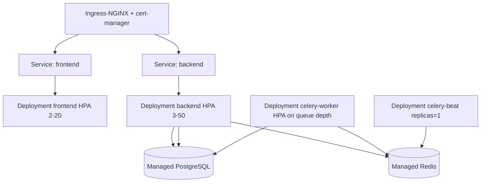

# Deployment

## Progression

```
Developer laptop            docker compose up (hot reload, local Postgres/Redis)
        |
        v
Staging                     docker-compose.prod.yml on a single VM OR small K8s
        |                   real TLS, managed Postgres/Redis, seeded like prod
        v
Production (small)          docker-compose.prod.yml, 2+ VMs behind a cloud LB
        |                   OR
Production (scale)          Kubernetes (Helm chart) + managed data services
```

Kubernetes is **not** used locally — Compose is faster and sufficient.

## Option A — Docker Compose (small deployments)

`docker-compose.prod.yml`:

- `nginx` (ports 80/443) -> `frontend` (3000) + `backend` (8000)
- `backend`, `frontend` are `deploy.replicas`-scalable; Nginx `upstream` uses DNS round-robin
  on the Compose service name.
- `celery-worker` (scale as needed), `celery-beat` (exactly 1).
- `postgres`, `redis` — **internal network only**, no published ports. In real prod, replace
  with managed services and delete these containers.
- Deploy: CI builds and pushes images; the host runs
  `docker compose -f docker-compose.prod.yml pull && ... up -d --remove-orphans`.
- Zero-downtime: `docker rollout` / `docker compose up -d --no-deps --scale backend=4` blue-ish,
  Nginx retries next upstream on connection failure.

## Option B — Kubernetes (scale)



- One Deployment per app tier; `readinessProbe: /readyz`, `livenessProbe: /healthz`.
- HPA on CPU + custom metric (queue depth for workers via KEDA).
- DB migrations run as a `Job` (or initContainer) gated before the new ReplicaSet scales up;
  migrations are backward-compatible so old+new pods coexist.
- Secrets from cloud secret store via External Secrets Operator.
- PodDisruptionBudgets + topology spread for AZ resilience.
- A `helm/` chart is the natural next artifact; the Compose files are the source of truth for
  container contracts today.

## CI/CD deploy stage

`.github/workflows/cd.yml` on `main`: build multi-arch images -> Trivy scan -> push to registry
(GHCR/ECR) with `sha` + `latest` tags -> deploy job per environment (`staging` auto,
`production` requires manual approval via GitHub Environments) -> run migration job -> health
gate -> notify.

## Cloud-managed equivalents (see cloud-ready section of README)

| Component | AWS | GCP | Azure |
|-----------|-----|-----|-------|
| PostgreSQL | RDS / Aurora | Cloud SQL / AlloyDB | Azure DB for PostgreSQL |
| Redis | ElastiCache | Memorystore | Azure Cache for Redis |
| Object storage | S3 | GCS | Blob Storage |
| Load balancer | ALB | Cloud LB | Application Gateway |
| Container registry | ECR | Artifact Registry | ACR |
| Secrets | Secrets Manager | Secret Manager | Key Vault |
| Monitoring | CloudWatch/AMP | Cloud Monitoring | Azure Monitor |
| Compute | ECS/EKS | GKE/Cloud Run | AKS/Container Apps |

Adopt managed Postgres and Redis first (highest ops burden), then object storage for uploads,
then a managed secret store.
